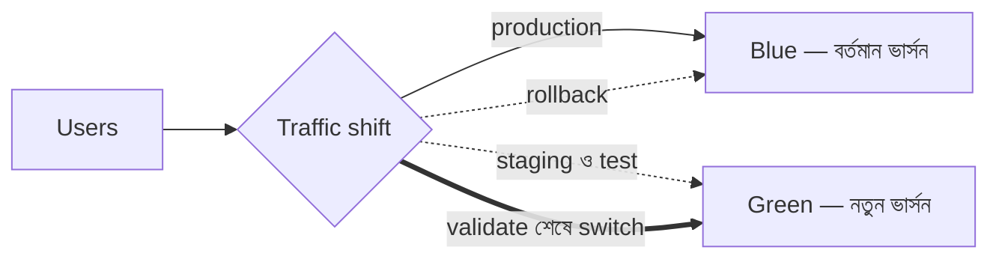

import KeywordTable from '../../../../components/content/KeywordTable.astro';
import Attribution from '../../../../components/content/Attribution.astro';
import MarkComplete from '../../../../components/progress/MarkComplete.astro';

> **Source:** Blue/Green Deployments on AWS, প্রিন্ট পেজ ১–৩ (Abstract, introduction, methodology ও benefits)।

## কেন blue/green?

Traditional deployment-এ ব্যর্থ release ঠিক করতে একই resource-এ আগের ভার্সন শুরু থেকে redeploy করতে হয়। এতে সময় লাগে, অ্যাপ long time unavailable থাকে, আর faulty ভার্সনটি মুছে যায় বলে সেটি debug করার সুযোগও থাকে না। Cloud-এর automation ও on-demand resource এই paradigm বদলে দেয় — দুটি একই রকম পরিবেশের মাঝে traffic shift করাই হলো **blue/green deployment**।

## পদ্ধতি

- **Blue environment** — চালু ভার্সন, এখন production traffic সামলাচ্ছে।
- **Green environment** — নতুন ভার্সন, পাশে স্টেজ করা ও পরীক্ষিত হচ্ছে।
- green ready হলে traffic blue থেকে green-এ যায়; সমস্যা হলে আবার blue-এ ফেরে।

## সুবিধা

- **Isolation** — green নিজস্ব resource-এ চলে, তাই তার সমস্যা blue-কে স্পর্শ করে না।
- **Canary analysis** — প্রথমে test traffic বা খুব অল্প production traffic দিয়ে যাচাই; বাস্তব user pattern-ও দেখা যায়।
- **Rollback** — traffic ফেরত পাঠালেই হয়; প্রভাব থাকে শুধু detection থেকে switch পর্যন্ত সময়টুকুতে।
- **CI/CD** — নতুন পরিবেশ পুরনো state/configuration-এর ওপর নির্ভর করে না, তাই pipeline সরল হয়।
- **Cost** — deployment-এ green scale-out ও blue scale-in করা যায়; শেষে blue decommission করলে তার খরচও বন্ধ।

## Exam traps

- Rollback মানে আগের ভার্সন **redeploy** নয় — মানে traffic **পুরনো পরিবেশে ফেরত** পাঠানো।
- Blue ও green দুটিই পুরোপুরি চলমান পরিবেশ; green "শুধু কোড" নয়।
- Canary testing-এর উদ্দেশ্য বাস্তব traffic প্যাটার্ন দেখা; শুধু synthetic test নয়।

<KeywordTable keywords={frontmatter.keywords} />

<Attribution sourceUrl={frontmatter.sourceUrl} updated={frontmatter.updated} />
<MarkComplete lessonId="bluegreen-1" />
