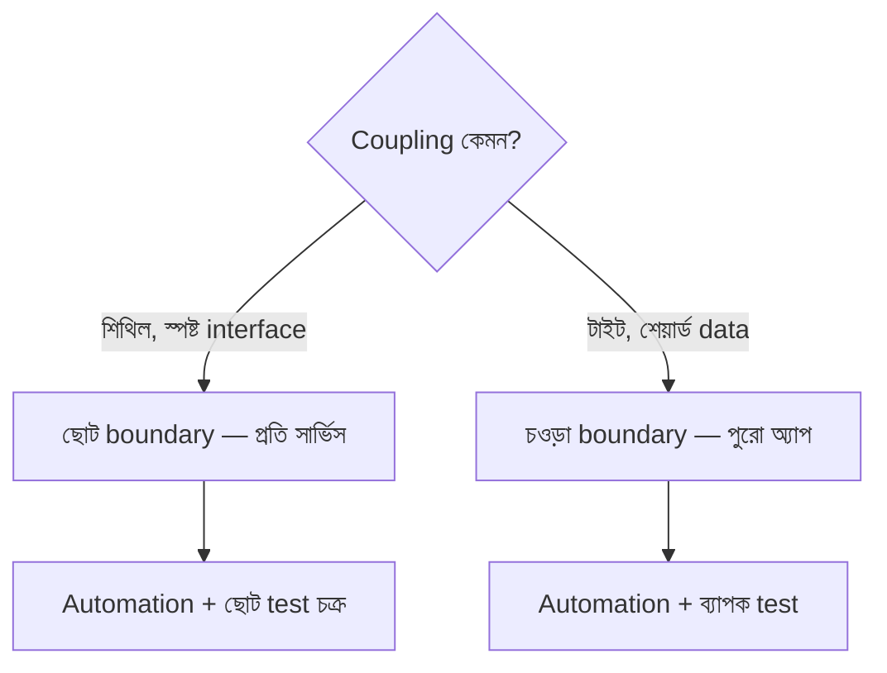

import KeywordTable from '../../../../components/content/KeywordTable.astro';
import Attribution from '../../../../components/content/Attribution.astro';
import MarkComplete from '../../../../components/progress/MarkComplete.astro';

> **Source:** Blue/Green Deployments on AWS, প্রিন্ট পেজ ৪ (Define the environment boundary)।

Blue/green পরিকল্পনার প্রথম প্রশ্ন: **environment boundary** কোথায়? অর্থাৎ কোথায় জিনিস বদলেছে, আর সেই change live করতে কী কী deploy করতে হবে। একই অ্যাপে সীমানা ছোট হতে পারে (একটি সার্ভিস) বা বড় (পুরো data tier সহ)।

## সীমানা ঠিক করে যেসব ফ্যাক্টর

| ফ্যাক্টর | দেখার বিষয় |
| --- | --- |
| Application architecture | dependency, loosely/tightly coupled |
| Organization | iteration-এর গতি ও সংখ্যা |
| Risk and complexity | blast radius ও ব্যর্থ deployment-এর impact |
| People | দলের expertise |
| Process | testing/QA, rollback capability |
| Cost | operating budget, অতিরিক্ত resource |

## উদাহরণ

- **Microservices** — শিথিল coupling ও সুনির্দিষ্ট interface থাকায় সীমানা ছোট হয়।
- **Legacy monolith** — blue/green এখনো সম্ভব, তবে scope চওড়া ও test বেশি ব্যাপক।

সীমানা যে-ই হোক, **automation** যথাসম্ভব ব্যবহার করুন — process দ্রুত হয়, human error কমে, cost নিয়ন্ত্রণে থাকে।

## Exam traps

- Boundary শুধু technical নয় — people, process ও cost-ও এর অংশ।
- Monolith-এ blue/green "অসম্ভব" নয়; শুধু সীমানা বড় ও test ভারী।
- সীমানা ছোট মানেই সবসময় সস্তা নয় — automation ছাড়া ছোট সীমানাও বারবার ভুল করায়।

<KeywordTable keywords={frontmatter.keywords} />

<Attribution sourceUrl={frontmatter.sourceUrl} updated={frontmatter.updated} />
<MarkComplete lessonId="bluegreen-2" />
