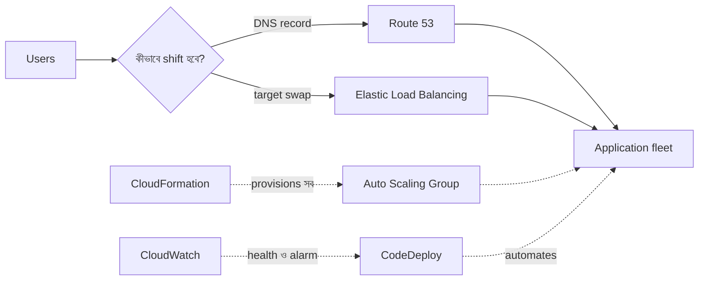

import KeywordTable from '../../../../components/content/KeywordTable.astro';
import Attribution from '../../../../components/content/Attribution.astro';
import MarkComplete from '../../../../components/progress/MarkComplete.astro';

> **Source:** Blue/Green Deployments on AWS, প্রিন্ট পেজ ৫–৭ (Services for blue/green deployments)।

## সার্ভিসগুলোর ভূমিকা এক নজরে

| সার্ভিস | blue/green-এ কাজ |
| --- | --- |
| Route 53 | DNS record বদলে traffic shift; ছোট TTL দরকার |
| Elastic Load Balancing | EC2-তে traffic ভাগ করা; health check; ASG-এর সাথে যুক্ত |
| Auto Scaling | launch configuration বদলে নতুন fleet; termination policy ও Standby |
| Elastic Beanstalk | সহজ প্রবর্তন; environment URL swap |
| OpsWorks | Chef-ভিত্তিক stack সহজে clone করা |
| CloudFormation | template-এ পরিবেশ দাঁড় করা ও traffic switch স্বয়ংক্রিয় করা |
| CloudWatch | metrics/log/alarm — প্রাথমিক health detection |
| CodeDeploy | built-in blue/green deployment ও rollback; CloudWatch alarm ভিত্তি |

## মনে রাখার মতো খুঁটিনাটি

- **Route 53**: authoritative DNS, health check/geography/latency-ভিত্তিক routing; **ছোট TTL** মানে record change দ্রুত propagate।
- **Auto Scaling**: launch configuration-এর ভিন্ন ভার্সন যুক্ত করে blue/green; termination policy কোন instance বাদ যাবে ঠিক করে; **Standby state** instance-কে terminate না করে সরিয়ে রাখে — rollback দ্রুত হয়।
- **CloudFormation**: IaC কৌশলের অংশ হিসেবে version control ও CI-র মতো software development প্র্যাকটিসে infrastructure চলে।
- **CodeDeploy**: ব্যর্থ হলে rollback করে; CloudWatch alarm দিয়ে deployment state monitor করা যায়; CloudWatch Events deployment/instance state change event প্রসেস করে।
- **ECS traffic shift**: **canary** — দুই increment-এ; **linear** — সমান increment-এ; **all-at-once** — সব traffic একবারে।
- **Lambda hooks**: ECS/Lambda/EC2 deployment-এর lifecycle event-এ CodeDeploy Lambda কল করে — workflow-এর ভেতরে validation বসায়।

## Exam traps

- "ছোট TTL"-এর কারণ DNS caching — মান বড় হলে পুরনো IP দীর্ঘদিন client-এ থেকে যায়।
- ASG-র **Standby** আর **terminate** এক নয় — Standby instance ফেরত আনা যায়, terminate করা যায় না।
- CodeDeploy-তে blue/green হলো built-in feature; শুধু EC2 নয় — Lambda ও ECS-তেও চলে।
- ECS-এ canary (২ ধাপ) আর linear (সমান ধাপ) গুলিয়ে ফেলবেন না।

<KeywordTable keywords={frontmatter.keywords} />

<Attribution sourceUrl={frontmatter.sourceUrl} updated={frontmatter.updated} />
<MarkComplete lessonId="bluegreen-3" />
