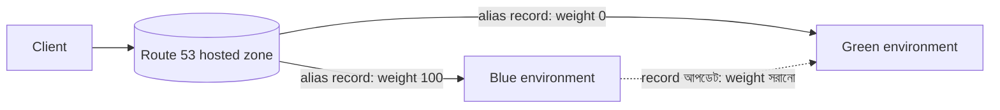

import KeywordTable from '../../../../components/content/KeywordTable.astro';
import Attribution from '../../../../components/content/Attribution.astro';
import MarkComplete from '../../../../components/progress/MarkComplete.astro';

> **Source:** Blue/Green Deployments on AWS, প্রিন্ট পেজ ৮–৯ (Update DNS Routing with Amazon Route 53)।

## কৌশলটা কী

DNS record আপডেট করে traffic সরানো blue/green-এর সবচেয়ে পরিচিত প্যাটার্ন। Route 53-এর hosted zone-এ **alias record** আপডেট করলেই traffic blue থেকে green-এ চলে যায়; rollback দরকার হলে record আবার blue-র দিকে ঘুরিয়ে দিতে হয়। শর্ত একটাই — পরিবেশের endpoint যেন DNS নাম বা IP দিয়ে প্রকাশ করা যায়।

কোন কোন পরিবেশ এই প্যাটার্নে চলে:

- public বা Elastic IP-যুক্ত single instance
- ELB বা third-party load balancer-এর পেছনের instance group
- ELB front-end সহ Auto Scaling group
- ELB-এর পেছনের ECS cluster-এ চলা সার্ভিস
- Elastic Beanstalk environment-এর web tier
- সংক্ষেপে — যেকোনো কনফিগারেশন যা DNS/IP endpoint দেয়

## একবারে সব, নাকি ধীরে ধীরে?

- **All-at-once** — record এক আপডেটেই পুরো traffic green-এ। সহজ, কিন্তু ধীরে ধীরে যাচাই করার সুযোগ নেই।
- **Weighted distribution** — green-এর জন্য একটা শতাংশ ঠিক করে ধীরে ধীরে weight বাড়ানো হয়, যতক্ষণ না green পুরো production traffic নেয়। এতে করে:
  - **canary analysis** — অল্প শতাংশ production traffic নতুন পরিবেশে দিয়ে নতুন কোড পরীক্ষা ও error monitoring; সমস্যা হলে blast radius ছোট থাকে।
  - green পরিবেশ পুরো load সামলাতে **scale out** করতে পারে (ELB থাকলে)।

ELB-র request-handling capacity inbound traffic দেখে নিজে নিজে বাড়ে — কিন্তু প্রক্রিয়াটা মুহূর্তেই ঘটে না। তাই নিজের traffic pattern পরীক্ষা করে, পর্যবেক্ষণ করে বুঝে নেওয়া জরুরি। চাইলে support request করে load balancer **pre-warm** (সর্বোচ্চ capacity-তে কনফিগার) করানো যায়।

## Rollback ও এর সীমাবদ্ধতা

Deployment-এ সমস্যা হলে DNS record আপডেট করে traffic আবার blue-তে ফেরানো যায়। কিন্তু:

- **DNS TTL** ঠিক করে দেয় client কতক্ষণ query result cache করবে — এটাই rollback-এর আসল ঘড়ি।
- পুরনো client বা DNS record বেশি দিন cache ধরে রাখা client কিছু **session আগের পরিবেশে আটকে রাখতে পারে** — record বদলালেও সঙ্গে সঙ্গে সবাই আসে না।

তবু এই প্যাটার্নের বড় সুবিধা হলো **নিজের গতিতে granular transition** — দীর্ঘ পরীক্ষা ও scaling activity-র সুযোগ। খরচ নিয়ন্ত্রণে Auto Scaling-কে actual demand অনুযায়ী scale out করানো যায়, weighted shift-এর সাথে এটা ভালো মেলে। Full cutover-এর সময় Auto Scaling policy ঠিকভাবে tune করা এবং নতুন ELB endpoint-ও scale-up-এর জন্য সময় নেয় — দুটোই মাথায় রাখতে হবে।

## Exam traps

- **বড় TTL = ধীর rollback**। "কেন ছোট TTL রাখা হয়?" — কারণ client দীর্ঘদিন পুরনো IP cache করে রাখে, record বদলালেও সবাই নতুন পরিবেশে আসে না।
- Weighted routing-এ শতাংশ মানে **traffic-এর ভাগ**, সংখ্যা নয় — ১০% মানে দশভাগের একভাগ request green-এ যাবে।
- ELB নিজে থেকে capacity বাড়ায়, কিন্তু **instant নয়** — বড় cutover-এর আগে pre-warm বা পর্যবেক্ষণ দরকার।
- DNS pattern সব কনফিগারেশনে চলে — একমাত্র শর্ত endpoint-টা **DNS নাম বা IP** হিসেবে প্রকাশযোগ্য হওয়া।

<KeywordTable keywords={frontmatter.keywords} />

<Attribution sourceUrl={frontmatter.sourceUrl} updated={frontmatter.updated} />
<MarkComplete lessonId="bluegreen-4" />
