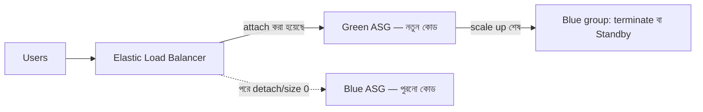

import KeywordTable from '../../../../components/content/KeywordTable.astro';
import Attribution from '../../../../components/content/Attribution.astro';
import MarkComplete from '../../../../components/progress/MarkComplete.astro';

> **Source:** Blue/Green Deployments on AWS, প্রিন্ট পেজ ১০–১২ (Swap the Auto Scaling Group behind the Elastic Load Balancer)।

## কেন এই প্যাটার্ন

DNS-এর জটিলতা (TTL, cache) বাধা হয়ে দাঁড়ালে traffic management-এর কাজটা load balancer-এর হাতে দিন। এই প্যাটার্নে **environment boundary ছোট হয়ে যায় Auto Scaling group-এ**: blue group production load বহন করে, green group নতুন কোড নিয়ে দাঁড়িয়ে থাকে। Deploy-এর সময় কাজ একটাই — **green group-কে চালু load balancer-এর সাথে attach করা**।

## ELB কীভাবে instance যোগ-বিয়োগ করে

- Auto Scaling ELB-র সাথে যুক্ত — **health check পাস করলে** নতুন instance স্বয়ংক্রিয়ভাবে load balancing pool-এ ঢোকে।
- Health check মানে সাধারণ ping, আরও পরিশীলিত connection attempt বা request; **interval ও threshold** কনফিগারযোগ্য।
- উদাহরণ: প্রতি ২০ সেকেন্ডে port 80-এ ping, ১০টি সফল ping-এর threshold পার হলে instance **InService**; যথেষ্ট ping time out হলে **OutofService** — Auto Scaling policy তাই বললে instance replace-ও হয়।
- Scale-down-এর সময় উল্টো পথ: load balancer instance-কে pool থেকে বাদ দিয়ে terminate-এর আগে **চলমান connection drain** করে।

## Traffic কেন green-এর দিকে ঝোঁকে

HTTP/HTTPS listener-এ load balancer **least outstanding requests** routing algorithm ব্যবহার করে — যে target-এর অসমাপ্ত request সবচেয়ে কম, সে-ই আগে পায়। নতুন যুক্ত green group হালকা থাকায় traffic স্বাভাবিকভাবেই সেদিকে সরে যায়। কতটা traffic যাবে সেটা green group-এর **size কমিয়ে-বাড়িয়ে** নিয়ন্ত্রণ করা যায়।

## Scale up, তারপর blue-র কী হবে

1. Green group scale up হওয়ার সময় blue group-এর instance **out of service** করা হয় — দুইভাবে: **terminate**, অথবা **Standby state**-এ সরিয়ে রাখা।
2. **Standby-ই ভালো পছন্দ**: rollback লাগলে blue instance-কে শুধু in service-এ ফেরত আনতে হয় — সঙ্গে সঙ্গে ব্যবহারের জন্য প্রস্তুত।
3. Green group নির্বিঘ্নে scale up হলে blue group **group size 0** করে decommission করা হয়।
4. Rollback দরকার হলে: load balancer থেকে **green group detach** করা, বা green group-এর size 0 করা।

## প্যাটার্নের সুবিধা ও ট্রেড-অফ

- Traffic management DNS-এর মতো granular নয়, তবু ASG-র কনফিগারেশন দিয়ে নিয়ন্ত্রণ মেলে — যেমন **আরও ছোট instance-এর বড় fleet** আর সূক্ষ্ম scaling policy, সাথে খরচ নিয়ন্ত্রণ।
- DNS-এর জটিলতা বাদ পড়ায় **traffic shift দ্রুত** হয়।
- Load balancer **আগে থেকেই warm** — production load-এর capacity নিয়ে নিশ্চিন্ত থাকা যায়।

## Exam traps

- **Standby ≠ terminate** — Standby instance ফেরত আনা যায়, terminate করা instance আর নয়; rollback-দৃষ্টিতে Standby-ই পছন্দ।
- Instance pool-এ ঢোকার শর্ত **health check পাস** — InService হওয়ার আগে নতুন instance traffic পায় না।
- Green-এর দিকে ঝোঁকের কারণ **least outstanding requests** — জাদু নয়, algorithm।
- প্যাটার্নের ট্রেড-অফ মনে রাখুন: DNS-এর চেয়ে **কম granular**, কিন্তু shift দ্রুত আর load balancer warm।

<KeywordTable keywords={frontmatter.keywords} />

<Attribution sourceUrl={frontmatter.sourceUrl} updated={frontmatter.updated} />
<MarkComplete lessonId="bluegreen-5" />
