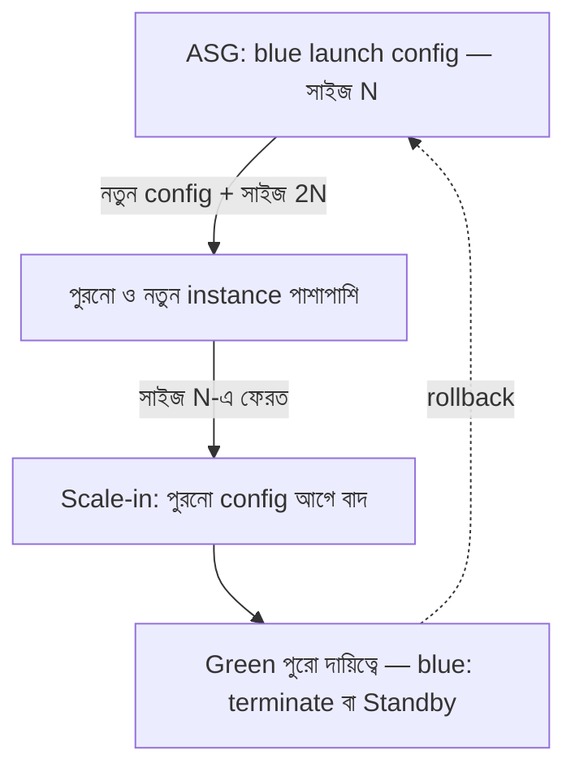

import KeywordTable from '../../../../components/content/KeywordTable.astro';
import Attribution from '../../../../components/content/Attribution.astro';
import MarkComplete from '../../../../components/progress/MarkComplete.astro';

> **Source:** Blue/Green Deployments on AWS, প্রিন্ট পেজ ১৩–১৫ (Update Auto Scaling Group launch configurations)।

## Launch configuration কী, কোথায় আটকে থাকে

Launch configuration-এ থাকে **AMI ID, instance type, key pair, এক বা একাধিক security group, block device mapping**। নিয়ম দুটো মনে রাখুন:

- এক Auto Scaling group-এ একসময়ে **একটাই** launch configuration যুক্ত থাকতে পারে।
- এটা **তৈরির পরে পরিবর্তনযোগ্য নয়** — বদলাতে হলে নতুন একটা তৈরি করে পুরনোটার জায়গায় **replace** করতে হয়।

নতুন launch configuration বসার পর **নতুন চালু হওয়া instance** নতুন প্যারামিটার পায়, কিন্তু **চলমান instance-দের কোনো প্রভাব পড়ে না** — এখানেই blue/green-এর সুযোগ।

## কৌশলটা ধাপে ধাপে

শুরুতে থাকে একটা Auto Scaling group আর একটা ELB load balancer; চালু launch configuration মানে blue পরিবেশ।

1. **নতুন launch configuration দিয়ে ASG আপডেট করুন** — এবং group-কে **দ্বিগুণ সাইজে** scale করুন। এখন পুরনো (blue) আর নতুন (green) instance পাশাপাশি চলছে, দুটোই load balancer-এর পেছনে।
2. **Group আবার মূল সাইজে ফেরান।** Scale-in-এ বাদ পড়ে কারা? Default termination policy: **পুরনো launch configuration-এর instance আগে বাদ যায়** — অর্থাৎ green-ই টিকে যায়।
3. চাইলে Standby state ব্যবহার করে পুরনো instance **সাময়িকভাবে** সরিয়ে রাখা যায় — নতুন ভার্সনে নিশ্চিত হওয়ার আগ পর্যন্ত।
4. **Rollback**: ASG-কে পুরনো launch configuration দিয়ে আপডেট করে ধাপগুলো উল্টো করে চালান; Standby-তে রাখা instance থাকলে তাদের **আবার online** আনুন।

## যে ব্যতিক্রমটা মনে রাখতে হয়: AZ rebalancing

Availability Zone শুরুতেই **unbalanced** থাকলে, scale-in-এ Auto Scaling zone-এর ভারসাম্য ঠিক করতে **নতুন launch configuration-এর instance-ও বাদ দিতে পারে** — default নিয়মের উল্টো। এমন পরিস্থিতির জন্য আগে থেকে **ক্ষতিপূরণের প্রক্রিয়া** রাখা উচিত।

## Exam traps

- Launch configuration **immutable** — "existing group-এর config এডিট করুন" জাতীয় উত্তর ভুল; সঠিক পথ **নতুনটা তৈরি করে replace**।
- নতুন config-এর প্রভাব **শুধু নতুন instance**-এ — চলমান instance নিজে থেকে বদলায় না।
- Default termination policy = **পুরনো launch configuration আগে বাদ**; কিন্তু **AZ rebalancing** এই নিয়ম ভাঙতে পারে — পরীক্ষার প্রিয় ব্যতিক্রম।
- ধাপ দুটো গুলিয়ে ফেলবেন না: আগে **নতুন config + দ্বিগুণ সাইজ**, পরে **মূল সাইজে নামা** — উল্টো করলে capacity নষ্ট হয়।

<KeywordTable keywords={frontmatter.keywords} />

<Attribution sourceUrl={frontmatter.sourceUrl} updated={frontmatter.updated} />
<MarkComplete lessonId="bluegreen-6" />
