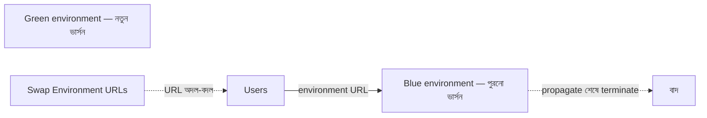

import KeywordTable from '../../../../components/content/KeywordTable.astro';
import Attribution from '../../../../components/content/Attribution.astro';
import MarkComplete from '../../../../components/progress/MarkComplete.astro';

> **Source:** Blue/Green Deployments on AWS, প্রিন্ট পেজ ১৬–২১ (Swap the environment of an Elastic Beanstalk application; Clone a Stack in AWS OpsWorks and Update DNS)।

## টেকনিক ৪ — Elastic Beanstalk environment swap

Beanstalk-এ অ্যাপ আপডেট করলে ডিফল্ট আচরণ হলো **in-place update** — চলমান instance-গুলোর ওপরেই নতুন ভার্সন বসে, তাই অল্প সময়ের জন্য অ্যাপ **unavailable** হতে পারে। এই downtime এড়ার পথই blue/green:

1. Blue environment Beanstalk-এ চালু করুন — চালু হলে Beanstalk একটি **environment URL** দেয়।
2. পুরনো environment-এর **configuration copy** করে সেটা দিয়ে green environment চালু করুন, নতুন ভার্সনের অ্যাপ সহ। Green-এরও নিজস্ব URL হয়।
3. এই মুহূর্তে দুই environment-ই চলছে, কিন্তু production traffic শুধু blue-র কাছে।
4. Promotion-এর সময়: Beanstalk console → environment dashboard → **Actions → Swap Environment URL**।
5. DNS পরিবর্তন ছড়িয়ে পড়লে blue environment **terminate** করুন। Rollback মানে আবার **Swap Environment URL**।

## টেকনিক ৫ — OpsWorks-এ stack clone করে DNS আপডেট

OpsWorks-এর মূল ধারণা দুটো:

- **Stack** — একই উদ্দেশ্যে যৌক্তিকভাবে একসাথে পরিচালিত AWS resource-এর গুচ্ছ (EC2, RDS, ELB ইত্যাদি)।
- **Layer** — stack-এর ভেতরে নির্দিষ্ট কাজের EC2 instance-এর সেট — যেমন অ্যাপ সার্ভ করা বা database server হোস্ট করা।

কাজের ধারা: বর্তমান ভার্সন নিয়ে **blue stack** চালু করুন → নতুন ভার্সন নিয়ে **green stack clone** করুন (এই অবস্থায় green কোনো traffic পায় না; দরকার হলে ELB-ও এখনই initialize করা যায়) → promotion-এর সময় **DNS record আপডেট করে green stack-এর load balancer-এর দিকে** নির্দেশ করান।

চাইলে Route 53-এর **weighted routing policy** দিয়ে এই DNS flip ধীরে ধীরেও করা যায়। প্রক্রিয়াটা DNS আপডেটের ওপর দাঁড়িয়ে থাকায় টেকনিক ১-এর সব DNS-সতর্কতা (বিশেষত **TTL**) এখানেও প্রযোজ্য। আর stack-এর অংশ হিসেবে data store থাকলে পরের পাঠে আলোচ্য data management চ্যালেঞ্জগুলোও মাথায় রাখতে হবে।

## Exam traps

- Beanstalk-এর **Swap Environment URLs** বাইরে থেকে URL swap মনে হলেও ভেতরে **DNS switch** — তাই TTL-জনিত rollback-ধীরগতি এখানেও খাটে।
- In-place deployment policy = সম্ভাব্য **downtime**; প্রশ্নে downtime-মুক্ত বললে উত্তর আলাদা environment-এ ডিপ্লয় করে swap।
- OpsWorks প্যাটার্নে green-কে traffic দেওয়ার একমাত্র পথ **DNS record আপডেট** — weighted routing দিয়ে তা ধাপে ধাপে করা যায়।
- Stack-এ data store থাকলে সেটা blue/green-এর **data sync সমস্যার** উৎস — clone করা মানেই ডেটা সমাধান নয়।

<KeywordTable keywords={frontmatter.keywords} />

<Attribution sourceUrl={frontmatter.sourceUrl} updated={frontmatter.updated} />
<MarkComplete lessonId="bluegreen-7" />
