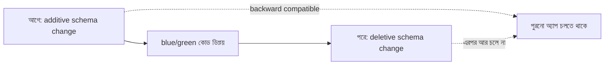

import KeywordTable from '../../../../components/content/KeywordTable.astro';
import Attribution from '../../../../components/content/Attribution.astro';
import MarkComplete from '../../../../components/progress/MarkComplete.astro';

> **Source:** Blue/Green Deployments on AWS, প্রিন্ট পেজ ২২–২৫ (Best Practices for Managing Data Synchronization and Schema Changes; When blue/green deployments are not recommended)।

## দুই পরিবেশেই ডেটা কেন হালনাগাদ থাকতে হয়

জটিলতা নির্ভর করে তিনটে জিনিসে — কয়টা data store, ডেটা মডেল কত জটিল, আর data consistency-র চাহিদা কত কড়া। দুই দিক থেকেই চাহিদা:

- **Green** হবে নতুন production — তার হালনাগাদ ডেটা দরকার।
- **Blue** দরকার rollback-এর জন্য — production ফেরত আসতে পারে বা থেকে যেতে পারে।

সমাধানের মূল কথা: **উভয়ে একই data store ভাগ করা**। এখানে unstructured store যেমন **Amazon S3**, NoSQL ডেটাবেস বা shared file system ভাগ করা তুলনামূলক সহজ; **RDBMS**-এ schema দুই পরিবেশে ভিন্ন হয়ে যেতে পারে বলে অতিরিক্ত বিবেচ্য বিষয় আসে।

## Schema change কে code change থেকে আলাদা রাখা

সাধারণ পরামর্শ — **schema change-কে code change থেকে decouple** করুন। তাহলে relational database blue/green-এর **environment boundary-র বাইরে** থেকে যায় এবং দুই পরিবেশ তা ভাগ করে নেয়। দুটি পন্থা, সাধারণত জোড়ায় জোড়ায় ব্যবহৃত হয়:

- **আগে schema বদলানো (additive)** — টেবিলে নতুন field, নতুন entity ও সম্পর্ক যোগ করা। Database আপডেট **backward compatible** হতে হবে, যাতে পুরনো অ্যাপ ডেটার সাথে কাজ চালিয়ে যেতে পারে। দরকার হলে trigger বা asynchronous প্রক্রিয়া দিয়ে পুরনো অ্যাপের ডেটা-পরিবর্তন থেকে নতুন কাঠামো ভরাট করা যায়।
- **পরে schema বদলানো (deletive)** — অপ্রয়োজনীয় field, entity, সম্পর্ক বাদ দেওয়া বা একত্র করা। এই বাদ দেওয়ার পরে **পুরনো অ্যাপ আর চলে না**।

কোডে সতর্কতা: অ্যাপ যেন টেবিলের **অতিরিক্ত field সহ** চলতে পারে, এমনকি সেগুলো ব্যবহার না করলেও। টেবিলের রো পড়ে কোডের object/hash-এ ম্যাপ করার সময় **না-বোঝা field উপেক্ষা করা** উচিত — নয়তো runtime error আসে।

## Deletive পন্থার ঝুঁকি ও প্রশমন

Deletive পন্থায় ঝুঁকি বেশি: schema পরিবর্তনে ব্যর্থতা **production-কে আঘাত করতে পারে**। ভালো প্র্যাকটিস না মানার কোনো অনথিভূত সমস্যা বা কোথাও বাদ পড়া field-এর ওপর নতুন অ্যাপের লুকানো নির্ভরতা — additive change-ও পুরনো অ্যাপ অচল করে দিতে পারে। প্রশমনের ভরসা **pre-deployment lifecycle**: শক্তিশালী testing phase ও framework, কড়া QA, আর test environment-এ ডিপ্লয় করে সমস্যা production-এ যাওয়ার আগেই ধরা।

## কখন blue/green সুপারিশ করা হয় না

কিছু প্যাটার্নে blue/green করা সম্ভব হলেও ঝুঁকি এমন যে সুবিধাই নষ্ট হয়:

- **Schema বদল decouple করা অসম্ভব, বা data store ভাগ করা সম্ভব নয়** — data locality-র কারণে পারফরম্যান্স বহুলাংশে কমে যায় (যেমন blue ও green ভৌগোলিকভাবে দূরের region-এ)। তখন data store-কে deployment boundary-র **ভেতরে** রেখে অ্যাপের সাথে শক্তভাবে যুক্ত করতেই হয় — আর তখন দুই পরিবেশের ডেটা **দুই দিকে synchronize** করতে হয়। এই সিঙ্ক ব্যবস্থা জটিল, consistency-চাহিদায় সীমাবদ্ধ, এবং ডিপ্লয়ের সময় তার নিজের reliability, scalability, performance-ও সামলাতে হয় — ঝুঁকি বাড়ে।
- **অ্যাপকে deployment-aware হতে হয়** — feature flag দিয়ে ডিপ্লয়ের সময় ফিচার চালু-বন্ধ ও ডেটা-সিঙ্ক রুটিন চালানো। এতে ঝুঁকি ও জটিলতা বাড়ে, তাই সুপারিশ করা হয় না। কারণ: blue/green-এর লক্ষ্য **immutable infrastructure** — ডিপ্লয়ের পরে বদল নয়, পুরোটা নতুন করে ডিপ্লয়; এতে production ও deployment দুই অবস্থাতেই একই কোড চলে।
- **COTS অ্যাপের vendor-নির্ধারিত update প্রক্রিয়া blue/green-বান্ধব নয়** — vendor-এর পরীক্ষিত প্রক্রিয়া বাইপাস করে blue/green নকল করাও অপ্রয়োজনীয় ঝুঁকি তৈরি করে; সুবিধা নষ্ট হতে পারে।

## Exam traps

- Schema পরিবর্তনের ক্রম **additive আগে, deletive পরে** — উল্টোটা পুরনো অ্যাপ ভেঙে দেয়।
- **RDBMS ভাগ করা সহজ নয়**; S3/NoSQL/shared file system ভাগ করা সহজ — প্রশ্নে store-এর ধরন খেয়াল করুন।
- Deployment-aware কোড (feature flag) blue/green-এ **সুপারিশ করা হয় না** — কারণটা immutable infrastructure।
- ভৌগোলিকভাবে দূরবর্তী পরিবেশে ডেটা ভাগ করলে **data locality-র কারণে পারফরম্যান্স কমে যায়** — এমন প্রশ্নে উত্তর blue/green **নয়**।

<KeywordTable keywords={frontmatter.keywords} />

<Attribution sourceUrl={frontmatter.sourceUrl} updated={frontmatter.updated} />
<MarkComplete lessonId="bluegreen-8" />
