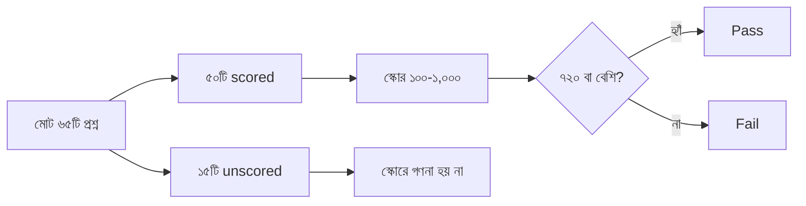

import KeywordTable from '../../../../components/content/KeywordTable.astro';
import Attribution from '../../../../components/content/Attribution.astro';
import MarkComplete from '../../../../components/progress/MarkComplete.astro';

> **Source:** SAA-C03 Exam Guide (v1.1), প্রিন্ট পেজ ১–২ (introduction, target candidate, response types, unscored content, exam results)।

## পরীক্ষাটি কী যাচাই করে

SAA-C03 পরীক্ষা solutions architect ভূমিকায় কাজ করা প্রার্থীদের জন্য — এটি যাচাই করে প্রার্থী **AWS Well-Architected Framework** ভিত্তিক সমাধান ডিজাইন করতে পারে কি না। গাইড অনুযায়ী প্রার্থী নিচের তিনটি কাজ করতে পারে:

- বর্তমান ব্যবসায়িক চাহিদা ও ভবিষ্যতের প্রক্ষেপিত চাহিদা মেটাতে AWS সার্ভিস দিয়ে সমাধান ডিজাইন করা;
- **নিরাপদ, resilient, high-performing ও cost-optimized** স্থাপত্য ডিজাইন করা — এই চারটি কথাই চারটি পরীক্ষা ডোমেইন;
- বিদ্যমান সমাধান পর্যালোচনা করে উন্নতি নির্ধারণ করা।

**Target candidate:** অন্তত **১ বছর** hands-on অভিজ্ঞতা — AWS সার্ভিস দিয়ে cloud solution ডিজাইন করার।

## প্রশ্নের ধরন

পরীক্ষায় দুই ধরনের প্রশ্ন আসে:

- **Multiple choice** — একটি সঠিক উত্তর, তিনটি ভুল উত্তর (distractor)।
- **Multiple response** — ৫টি বা তার বেশি option-এর মধ্যে ২টি বা তার বেশি সঠিক উত্তর।

Distractor গুলো এমনভাবে তৈরি যে অসম্পূর্ণ জ্ঞানের প্রার্থী সেগুলোই বেছে নিতে পারে — সেগুলো **বিশ্বাসযোগ্য** এবং সঠিক উত্তরের সঙ্গে একই content area-র। মানে প্রশ্নটি যে টপিকে, distractor-ও সেই টপিকেই; পুরোপুরি বাইরের কোনো অপশন থাকে না।

## কয়টি প্রশ্ন স্কোর হয়?

পরীক্ষায় মোট ৬৫টি প্রশ্ন থাকে, কিন্তু **৫০টি প্রশ্নই কেবল স্কোরে গণনা হয়**। বাকি **১৫টি unscored** — AWS ভবিষ্যতের scored প্রশ্ন হিসেবে মূল্যায়নের জন্য এগুলোতে পারফরম্যান্স তথ্য সংগ্রহ করে। পরীক্ষার সময় unscored প্রশ্নগুলো **চেনা যায় না**, তাই প্রতিটি প্রশ্নে পুরো মনোযোগ দিতে হবে।

উত্তর না দেওয়া প্রশ্ন **ভুল হিসেবে গণনা হয়**; guessing-এর কোনো শাস্তি নেই — তাই প্রতিটি প্রশ্নে সেরা অনুমানটিও উত্তর হিসেবে দিয়ে যাওয়াই সুবিধাজনক।

## ফলাফল ও স্কোরিং

- ফলাফল আসে **pass বা fail** হিসেবে; স্কোর রিপোর্ট হয় **১০০–১,০০০** scaled score-এ।
- **Minimum passing score: ৭২০।**
- Scaled scoring-এর উদ্দেশ্য — সামান্য ভিন্ন কঠিনতার একাধিক exam form-এর স্কোর তুলনীয় করা।
- স্কোর রিপোর্টে **সেকশন-স্তরের পারফরম্যান্স শ্রেণিবিভাগের** টেবিল থাকতে পারে — কোথায় শক্তিশালী, কোথায় দুর্বল।
- পরীক্ষা **compensatory scoring model** অনুসরণ করে: প্রতিটি সেকশনে আলাদা পাসিং স্কোরের প্রয়োজন নেই, সামগ্রিক পরীক্ষায় পাস করলেই হলো।
- সেকশন-স্তরের feedback সাধারণ তথ্য মাত্র — এটি প্রতিটি ডোমেইনের শক্তি-দুর্বলতা দেখায়, প্রশ্নের সঠিক সংখ্যা নয়; গাইড নিজেই এই feedback ব্যাখ্যায় সতর্কতার কথা বলে।

পরীক্ষার সময়সীমা বা সময়সূচি এই গাইডে নেই — সেগুলো AWS certification পেজের বিষয়; পরীক্ষার প্রস্তুতির জন্য গাইডে যা বলা আছে, এখানে তা-ই ধরা হয়েছে।

<KeywordTable keywords={frontmatter.keywords} />

## Exam trap

- **"পাস মার্ক ৭০০"** — না। SAA-C03 গাইড বলছে **৭২০**; পুরোনো ৭০০ সংখ্যাটি অন্য পরীক্ষার বা পুরোনো সংস্করণের স্মৃতি।
- **"৬৫টি প্রশ্নই স্কোর হয়"** — না। ৫০টি scored + ১৫টি unscored; unscored চেনার কোনো উপায় নেই।
- **"এক ডোমেইনে দুর্বল হলে পরীক্ষা ফেল"** — compensatory scoring-এ প্রতি সেকশনে পাস করতে হয় না; সামগ্রিক স্কোরই দেখা হয়।
- **"unscored প্রশ্ন বাদ দিয়ে দিই"** — unscored চেনা যায় না, তাই সব প্রশ্নেই সমান মনোযোগ দিতে হবে।
- **"guessing-এ নেগেটিভ মার্কিং"** — নেই; উত্তর না দেওয়া নিশ্চিত ভুল, অনুমান অন্তত সুযোগ দেয়।

<Attribution sourceUrl="https://d1.awsstatic.com/training-and-certification/docs-sa-assoc/AWS-Certified-Solutions-Architect-Associate_Exam-Guide.pdf" updated="2026-09-17" />

<MarkComplete lessonId="examguide-1" />
