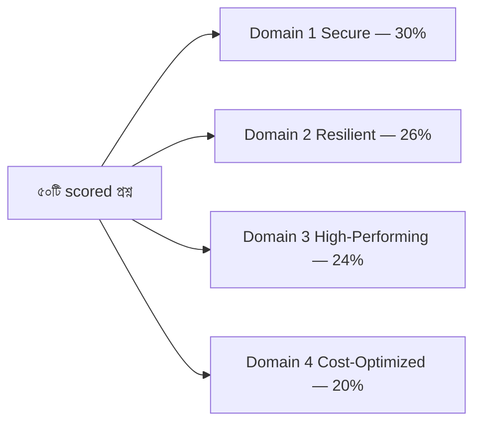

import KeywordTable from '../../../../components/content/KeywordTable.astro';
import Attribution from '../../../../components/content/Attribution.astro';
import MarkComplete from '../../../../components/progress/MarkComplete.astro';

> **Source:** SAA-C03 Exam Guide (v1.1), প্রিন্ট পেজ ২–৩ (domain list, weightings ও সেকশন-স্তরের feedback নির্দেশনা)।

## চারটি ডোমেইন

গাইডের ভাষায় পরীক্ষার চারটি ডোমেইন ও তাদের weighting — "of scored content" মানে ভাগটি ৫০টি scored প্রশ্নের:

| ডোমেইন | নাম | Weighting | ৫০ প্রশ্নে আনুমানিক |
| --- | --- | ---: | ---: |
| ১ | Design **Secure** Architectures | ৩০% | ~১৫ |
| ২ | Design **Resilient** Architectures | ২৬% | ~১৩ |
| ৩ | Design **High-Performing** Architectures | ২৪% | ~১২ |
| ৪ | Design **Cost-Optimized** Architectures | ২০% | ~১০ |

Weighting টেবিল হলো **স্টাডি বাজেট** — ডোমেইন ১-এ সবচেয়ে বেশি সময় দেওয়ার সুস্পষ্ট কারণ। কিন্তু compensatory scoring-এর কারণে প্রতিটি ডোমেইনেই প্রশ্ন আসে এবং প্রতিটির উত্তরই সামগ্রিক স্কোরের ৭২০ পাস মার্কে গণনা হয়; কোনো ডোমেইন "বাদ" দেওয়ার সুযোগ নেই।

## প্রতিটি ডোমেইনের ভেতরে কী থাকে

প্রতিটি ডোমেইন ভেতরে **task statement**-এ ভাগ করা (যেমন Task Statement 1.1, 1.2)। প্রতিটি task-এ দুটি তালিকা:

- **Knowledge of** — কী জানতে হবে: সার্ভিস, বৈশিষ্ট্য ও ধারণার নাম।
- **Skills in** — কী করতে পারতে হবে: কোন সিনারিওতে কোন সার্ভিস বা ডিজাইন বেছে নেবেন।

পরীক্ষার প্রশ্ন এই task statement গুলো থেকেই তৈরি — তাই প্রস্তুতির সবচেয়ে জরুরি চেকলিস্ট এটাই। পরবর্তী চারটি লেসন চারটি ডোমেইনের task গুলো একে একে বাংলায় সাজায়:

- ডোমেইন ১ (৩০%) — secure access, secure workloads, data security controls
- ডোমেইন ২ (২৬%) — scalable ও loosely coupled ডিজাইন, HA/fault-tolerant ডিজাইন
- ডোমেইন ৩ (২৪%) — storage, compute, database, network, data ingestion
- ডোমেইন ৪ (২০%) — cost-optimized storage, compute, database, network

## সেকশন-স্তরের feedback কীভাবে পড়বেন

স্কোর রিপোর্টের শ্রেণিবিভাগ টেবিল প্রতিটি ডোমেইনের শক্তি ও দুর্বলতার **সাধারণ** ছবি দেয় — এটি নির্দিষ্ট প্রশ্নের উত্তর নয়। গাইড স্পষ্টভাবে বলে feedback ব্যাখ্যায় **সতর্ক** থাকতে হবে। ব্যবহারিকভাবে এর মানে:

- দুর্বল ডোমেইনের task statement গুলো আগে রিভিশন করুন;
- ভালো করা ডোমেইনেও ভিন্ন প্রশ্ন আসতে পারে — feedback কোনো গ্যারান্টি নয়;
- পুরো পাঠ্যসূচি জুড়ে সমান গভীরতা রাখুন, বাজেট শুধু সময় ভাগ করুন।

## Exam trap

- **"চার ডোমেইন সমান গুরুত্বপূর্ণ"** — সমান *অপরিহার্য*, কিন্তু সমান *ওজনের* নয়: ৩০/২৬/২৪/২০।
- **"weighting = সঠিক প্রশ্ন সংখ্যা"** — আনুমানিক প্রশ্ন-ভাগ মাত্র; গাইড প্রশ্ন সংখ্যা ঘোষণা করে না।
- **"দুর্বল ডোমেইন বাদ দিলেও পাস হওয়া যায়"** — compensatory মানে প্রতি সেকশনে আলাদা পাস লাগে না, বড় গ্যাপ মানেই সামগ্রিক স্কোর নিচে নামে।
- **"পরীক্ষার প্রশ্ন সরাসরি গাইডের উদাহরণ থেকে আসে"** — প্রশ্ন task statement থেকে *তৈরি* হয়; গাইডে নমুনা প্রশ্ন নেই।

<KeywordTable keywords={frontmatter.keywords} />

<Attribution sourceUrl="https://d1.awsstatic.com/training-and-certification/docs-sa-assoc/AWS-Certified-Solutions-Architect-Associate_Exam-Guide.pdf" updated="2026-09-17" />

<MarkComplete lessonId="examguide-2" />
