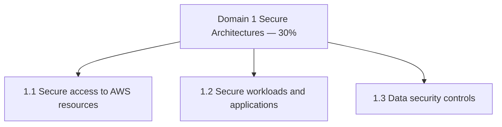

import KeywordTable from '../../../../components/content/KeywordTable.astro';
import Attribution from '../../../../components/content/Attribution.astro';
import MarkComplete from '../../../../components/progress/MarkComplete.astro';

> **Source:** SAA-C03 Exam Guide (v1.1), প্রিন্ট পেজ ৩–৫ (Domain 1: Task Statement 1.1–1.3)।

## এক নজরে

**৩০% of scored content** — চার ডোমেইনের সবচেয়ে ভারী। ৫০টি scored প্রশ্নের প্রায় ১৫টি এখান থেকে আসে, তাই স্টাডি বাজেটেরও সবচেয়ে বড় অংশ এটি পাওয়ার কথা। ডোমেইনটিতে তিনটি task statement আছে।

## Task 1.1 — AWS resource-এ secure access ডিজাইন

**যা জানতে হবে:** বহু-account access control; federated access ও identity সার্ভিস (IAM, **IAM Identity Center**); global infrastructure (Region, AZ); security best practice (এবং এর কেন্দ্রে **least privilege**); **shared responsibility model**।

**যা করতে পারতে হবে:**

- IAM user ও **root user**-এ best practice — root-এ MFA, দৈনন্দিন কাজে root ব্যবহার না করা;
- user, group, role ও policy মিলিয়ে নমনীয় authorization model ডিজাইন;
- **AWS STS** দিয়ে role-based access: role switching, cross-account access;
- বহু-account কৌশল: **AWS Control Tower**, **service control policies (SCP)**;
- কোন সার্ভিসে **resource policy** ব্যবহার করা যায় তা নির্ধারণ;
- কখন directory service-কে IAM role-এর সঙ্গে federate করতে হয়।

**পরীক্ষার সংকেত:** বহু-account + governance = Control Tower/SCP; সাময়িক access = STS role; কেন্দ্রীয় identity ব্যবস্থাপনা = IAM Identity Center।

## Task 1.2 — Secure workloads ও application ডিজাইন

**যা জানতে হবে:** application configuration ও credential security; AWS service endpoint; port, protocol ও network traffic নিয়ন্ত্রণ; secure application access; সার্ভিস-ভিত্তিক নিরাপত্তা সার্ভিস (**Cognito**, **GuardDuty**, **Macie**); AWS-এর বাইরের threat vector — **DDoS, SQL injection**।

**যা করতে পারতে হবে:**

- **security group, route table, network ACL, NAT gateway** দিয়ে VPC security architecture ডিজাইন;
- **public/private subnet** দিয়ে network segmentation কৌশল ঠিক করা;
- **AWS Shield, AWS WAF, IAM Identity Center, AWS Secrets Manager** ইত্যাদি দিয়ে অ্যাপ রক্ষা;
- **VPN ও AWS Direct Connect** দিয়ে AWS-এর ভেতরে-বাইরের সংযোগ সুরক্ষিত করা।

**পরীক্ষার সংকেত:** SQL injection/web exploit = WAF; volumetric DDoS = Shield; secret সংরক্ষণ = Secrets Manager (কোডে নয়); VPC সীমানার ভিত = security group বনাম NACL-এর পার্থক্য।

## Task 1.3 — Data security controls নির্ধারণ

**যা জানতে হবে:** data access ও governance; data recovery; **data retention ও classification**; এনক্রিপশন ও উপযুক্ত **key management**।

**যা করতে পারতে হবে:**

- compliance requirement অনুযায়ী AWS প্রযুক্তি নির্বাচন;
- **at rest** এনক্রিপশন — **AWS KMS**; **in transit** — **ACM** দিয়ে TLS;
- এনক্রিপশন key-র access policy ও key rotation, certificate renewal;
- backup ও replication; data access, lifecycle ও protection policy।

**পরীক্ষার সংকেত:** প্রশ্নে "at rest" থাকলে KMS, "in transit" থাকলে TLS/ACM — দুটো মেশানো অপশন ফাঁদ হয়।

## এই ডোমেইন অন্য থিমের কোথায়

- IAM ও least privilege-এর বিস্তারিত আলোচনা মাইক্রোসার্ভিসেস থিমের security লেসনে;
- VPC-ভিত্তিক workload security নিয়ে microservices-এর networking লেসনেও কাজে লাগে।

## Exam trap

- **"root user দিয়ে দৈনন্দিন কাজ"** — কখনই নয়; root-এ MFA, বাকি সব IAM user/role-এ।
- **"SCP অনুমতি দেয়"** — SCP শুধু **সীমা** টানে; অনুমতি দিতে IAM policy লাগে।
- **"secret কোডে বা environment variable-এ রাখা"** — Secrets Manager বা সমতুল্য ব্যবস্থাই সঠিক উত্তর।
- **"এনক্রিপশন মানেই শুধু at rest"** — প্রশ্ন in-transit (TLS/ACM) চাইলে at-rest অপশন ফাঁদ।
- **"GuardDuty ডেটা এনক্রিপ্ট করে"** — GuardDuty threat detection করে; এনক্রিপশন KMS-এর কাজ; Macie S3-এ সংবেদনশীল ডেটা খোঁজে।

<KeywordTable keywords={frontmatter.keywords} />

<Attribution sourceUrl="https://d1.awsstatic.com/training-and-certification/docs-sa-assoc/AWS-Certified-Solutions-Architect-Associate_Exam-Guide.pdf" updated="2026-09-17" />

<MarkComplete lessonId="examguide-3" />
