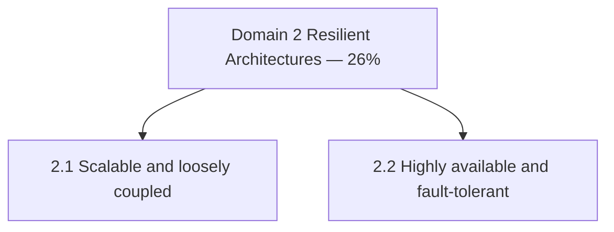

import KeywordTable from '../../../../components/content/KeywordTable.astro';
import Attribution from '../../../../components/content/Attribution.astro';
import MarkComplete from '../../../../components/progress/MarkComplete.astro';

> **Source:** SAA-C03 Exam Guide (v1.1), প্রিন্ট পেজ ৫–৭ (Domain 2: Task Statement 2.1–2.2)।

## এক নজরে

**২৬% of scored content** — দ্বিতীয় বৃহত্তম ভাগ। দুটি task statement: scalable/loosely coupled ডিজাইন এবং HA/fault-tolerant ডিজাইন। মাইক্রোসার্ভিসেস ও ব্লু/গ্রিন থিমের বেশিরভাগ বিষয় এই ডোমেইনেই গণনা হয়।

## Task 2.1 — Scalable ও loosely coupled architecture ডিজাইন

**যা জানতে হবে (ভাগ করে পড়ুন):**

- **API ও integration** — API Gateway, REST;
- **managed services** — SQS, Transfer Family, Secrets Manager;
- **decoupling প্যাটার্ন** — event-driven architecture, queuing/messaging (publish/subscribe), Step Functions workflow orchestration;
- **compute প্যাটার্ন** — microservices (stateless বনাম stateful), container migration, ECS/EKS orchestration, serverless (Lambda, Fargate);
- **scaling** — horizontal বনাম vertical scaling, read replicas কখন;
- **অন্যান্য** — caching strategy, CDN edge accelerator, multi-tier architecture, storage types (object/file/block)।

**যা করতে পারতে হবে:** requirement অনুযায়ী event-driven, microservice বা multi-tier architecture ডিজাইন; scaling strategy নির্ধারণ; loose coupling-এর জন্য সঠিক সার্ভিস বাছাই; কখন container, কখন serverless; compute/storage/network/database সমন্বিত পছন্দ; workload-এর জন্য purpose-built সার্ভিস।

**পরীক্ষার সংকেত:** প্রশ্নে "স্বাধীনভাবে scale", "সাময়িক ট্রাফিক বৃদ্ধি" বা "ব্যর্থতা ছড়িয়ে পড়া থামানো" থাকলে decoupling সার্ভিস (SQS/SNS/EventBridge) যোগ করার অপশনটি সাধারণত সঠিক।

## Task 2.2 — Highly available ও fault-tolerant architecture ডিজাইন

**যা জানতে হবে:**

- global infrastructure — Region, AZ, Route 53;
- **DR strategies** — backup and restore, pilot light, warm standby, active-active failover; সঙ্গে **RPO/RTO**;
- failover strategy ও distributed design pattern; **immutable infrastructure**;
- load balancing (ALB), proxy (RDS Proxy);
- **service quotas ও throttling** — যেমন standby environment-এর quota configuration;
- storage characteristics (durability, replication); workload visibility (X-Ray)।

**যা করতে পারতে হবে:** Region/AZ জুড়ে HA স্থাপত্যের সার্ভিস নির্বাচন; business requirement থেকে metric চিহ্নিত করা; single point of failure দূর করা; ডেটার durability/availability নিশ্চিত করা; ব্যবসায়িক চাহিদা মেটাতে **সঠিক DR strategy বাছাই**; অ্যাপ পরিবর্তন সম্ভব না হলে legacy application-এর reliability বাড়ানো।

**পরীক্ষার সংকেত:** RPO/RTO ছোট হলে খরচ বাড়ে — backup/restore (সবচেয়ে ধীর) → pilot light → warm standby → active-active (সবচেয়ে দ্রুত)। প্রশ্নে ব্যবসায়িক সীমা ও বাজেট দুটোই পড়ুন।

## এই ডোমেইন অন্য থিমের কোথায়

- **ডিজাইন প্যাটার্ন লেসন** — microservices থিমের distributed systems বিষয়গুলো এই task-এর সরাসরি প্রস্তুতি;
- **লেসন ৯ (DR/HA)** — RPO/RTO ও DR strategy-র বিস্তারিত আলোচনা মাইক্রোসার্ভিসেস থিমে;
- **টেকনিক ৩ ও ৬** — immutable infrastructure ও ASG-based swap ব্লু/গ্রিন থিমে (launch configuration আপডেট ও deployment)।

## Exam trap

- **"fault tolerance = high availability"** — HA মানে ব্যর্থতায় কিছু সময় ডাউনটাইম মেনে চলা যায়; fault tolerance মানে এক component ব্যর্থ হলেও ব্যবহারকারী কিছু বোঝে না।
- **"multi-AZ ডিজাইন দুর্যোগ-সহনশীল"** — multi-AZ এক Region-এর ভেতরের HA; পুরো Region ব্যর্থতার প্রস্তুতিতে multi-Region লাগে।
- **"RPO ও RTO একই জিনিস"** — RPO ডেটা হানির সীমা, RTO ফিরে আসার সময়সীমা।
- **"queue যোগ করলেই coupling কমে"** — ঠিক দিকে যোগ করতে হয়; কোন component-এর মাঝে bottleneck তা প্রশ্ন থেকে বের করুন।
- **"auto scaling-ই সব সমস্যার সমাধান"** — scaling কাউন্টার মেট্রিকের উপর নির্ভর করে; মেট্রিক ভুল হলে scaling সঠিক সময়ে ঘটে না।

<KeywordTable keywords={frontmatter.keywords} />

<Attribution sourceUrl="https://d1.awsstatic.com/training-and-certification/docs-sa-assoc/AWS-Certified-Solutions-Architect-Associate_Exam-Guide.pdf" updated="2026-09-17" />

<MarkComplete lessonId="examguide-4" />
