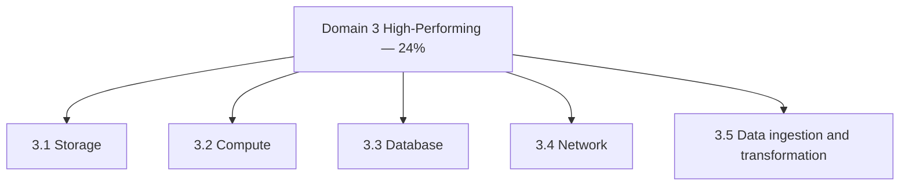

import KeywordTable from '../../../../components/content/KeywordTable.astro';
import Attribution from '../../../../components/content/Attribution.astro';
import MarkComplete from '../../../../components/progress/MarkComplete.astro';

> **Source:** SAA-C03 Exam Guide (v1.1), প্রিন্ট পেজ ৭–১০ (Domain 3: Task Statement 3.1–3.5)।

## এক নজরে

**২৪% of scored content** — চারটি নয়, **পাঁচটি** task statement-এর ডোমেইন: storage, compute, database, network ও data ingestion/transformation। প্রশ্ন-প্যাটার্ন সাধারণত "এই workload-এর জন্য সবচেয়ে পারফরম্যান্ট বিকল্প কোনটি"।

## Task 3.1 — High-performing storage

**যা জানতে হবে:** hybrid storage; সার্ভিস ও use case — **S3** (object), **EFS** (file), **EBS** (block); প্রতিটি type-এর বৈশিষ্ট্য।

**যা করতে হবে:** performance demand মেটানো storage ও configuration নির্ধারণ; ভবিষ্যতের চাহিদায় scale করতে পারে এমন storage নির্বাচন।

**সংকেত:** ভাগ করা file access = EFS; boot volume/transactional = EBS; বিশাল অবজেক্ট ও static content = S3; on-premises সংযোগ = hybrid (Storage Gateway)।

## Task 3.2 — Elastic compute

**যা জানতে হবে:** compute সার্ভিস ও use case — **Batch, EMR, Fargate**; edge ও global infrastructure-এর distributed computing; queuing/messaging; scaling — **EC2 Auto Scaling, AWS Auto Scaling**; serverless; ECS/EKS।

**যা করতে হবে:** workload ভেঙে প্রতিটি অংশ স্বাধীনভাবে scale করা; scaling-এর metric ও condition নির্ধারণ; সঠিক compute option (যেমন EC2 instance type) ও resource size (যেমন **Lambda memory**) নির্বাচন।

**সংকেত:** "সবচেয়ে কম পরিচালনা" = serverless (Lambda/Fargate); container orchestration-এ ECS বনাম EKS — Kubernetes দরকার হলে EKS।

## Task 3.3 — High-performing database

**যা জানতে হবে:** caching (**ElastiCache**); data access pattern (read-intensive বনাম write-intensive); capacity planning (capacity unit, instance type, **Provisioned IOPS**); connection ও proxy; engine নির্বাচন; **read replica**; database types (serverless, relational বনাম non-relational, in-memory)।

**যা করতে হবে:** read replica configure করা; database architecture ডিজাইন; engine নির্বাচন (MySQL বনাম PostgreSQL); type নির্বাচন (**Aurora** বনাম **DynamoDB**); caching যুক্ত করা।

**সংকেত:** read-heavy = read replica + ElastiCache; নমনীয় schema ও বিশাল scale = DynamoDB; RDBMS-সামঞ্জস্য + পারফরম্যান্স = Aurora; connection বৃদ্ধির সমস্যা = **RDS Proxy**।

## Task 3.4 — High-performing network

**যা জানতে হবে:** edge সার্ভিস — **CloudFront, Global Accelerator**; subnet tier, routing, IP addressing দিয়ে network design; load balancing; connection options — VPN, **Direct Connect, PrivateLink**।

**যা করতে হবে:** global/hybrid/multi-tier topology তৈরি; ভবিষ্যতের চাহিদায় scale হয় এমন configuration; resource placement; সঠিক load balancing strategy।

**সংকেত:** static/web content = CloudFront; non-HTTP latency = Global Accelerator; নির্ভরযোগ্য dedicated লাইন = Direct Connect; ভেতরের সার্ভিস প্রকাশ না করে ব্যবহার = PrivateLink।

## Task 3.5 — Data ingestion ও transformation

**যা জানতে হবে:** analytics/visualization — **Athena, Lake Formation, QuickSight**; ingestion pattern (frequency); transfer — **DataSync, Storage Gateway**; transformation — **Glue**; ingestion point-এ secure access; size/speed; streaming — **Kinesis**।

**যা করতে হবে:** data lake তৈরি ও সুরক্ষা; streaming architecture ও transfer solution ডিজাইন; visualization; data processing-এ compute নির্বাচন (EMR); ingestion configuration; ফরম্যাট রূপান্তর (যেমন `.csv` → `.parquet`)।

**সংকেত:** রিয়েল-টাইম = Kinesis; batch ETL = Glue; S3-তে SQL = Athena; on-prem → AWS ডেটা স্থানান্তর = DataSync।

## এই ডোমেইন অন্য থিমের কোথায়

- caching ও read replica — মাইক্রোসার্ভিসেস থিমের datastore লেসনে;
- CloudFront/edge — microservices-এর networking লেসনে;
- Lambda ও Fargate — microservices-এর Lambda deployment ও serverless লেসনে।

## Exam trap

- **"EBS ও EFS একই কাজ"** — EBS এক instance-এ লাগে, EFS অনেক instance জুড়ে ভাগ হয়।
- **"read replica লেখার ক্ষমতাও বাড়ায়"** — পঠন-চাপ ভাগ করে মাত্র; write-heavy সমস্যায় অন্য সমাধান খুঁজুন।
- **"Global Accelerator কনটেন্ট ক্যাশ করে"** — করে না; সে IP/network পথ অপটিমাইজ করে; ক্যাশিং CloudFront-এর কাজ।
- **"Kinesis batch processing-এর জন্য"** — Kinesis স্ট্রিমিং/রিয়েল-টাইম; batch ETL-এ Glue/EMR।
- **"Aurora ও RDS ভিন্ন শ্রেণি"** — Aurora-ই RDS পরিবারের engine; পার্থক্য performance ও replication মডেলে।

<KeywordTable keywords={frontmatter.keywords} />

<Attribution sourceUrl="https://d1.awsstatic.com/training-and-certification/docs-sa-assoc/AWS-Certified-Solutions-Architect-Associate_Exam-Guide.pdf" updated="2026-09-17" />

<MarkComplete lessonId="examguide-5" />
