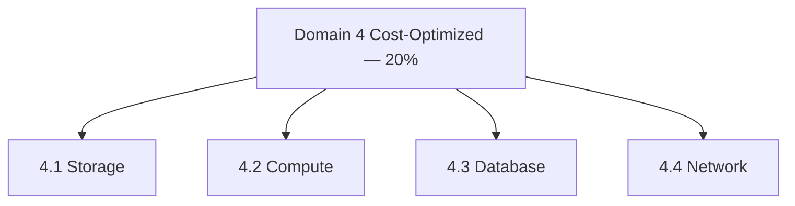

import KeywordTable from '../../../../components/content/KeywordTable.astro';
import Attribution from '../../../../components/content/Attribution.astro';
import MarkComplete from '../../../../components/progress/MarkComplete.astro';

> **Source:** SAA-C03 Exam Guide (v1.1), প্রিন্ট পেজ ১০–১৪ (Domain 4: Task Statement 4.1–4.4)।

## এক নজরে

**২০% of scored content** — সবচেয়ে হালকা ডোমেইন, কিন্তু প্রশ্নগুলো প্রায়ই অন্য ডোমেইনের প্রশ্নের সঙ্গে মিশে থাকে ("কাজটিও করবে, খরচও কমবে")। চারটি task statement: storage, compute, database, network।

## Task 4.1 — Cost-optimized storage

**যা জানতে হবে:** access options (যেমন **Requester Pays**); cost management feature — cost allocation tag, multi-account billing; টুল — **Cost Explorer, AWS Budgets, Cost and Usage Report**; storage সার্ভিস (FSx, EFS, S3, EBS); backup strategy; block storage type (HDD/SSD); **data lifecycle**; hybrid options; access pattern; **storage tiering** (cold tiering)।

**যা করতে হবে:** সঠিক storage strategy (যেমন একে একে নয়, **batch upload**); সঠিক আকার; ডেটা আনতে সবচেয়ে সস্তা পথ; কখন storage auto scaling; **S3 object lifecycle** ব্যবস্থাপনা; সঠিক backup/archival সমাধান; সঠিক tier ও lifecycle; workload-এর সবচেয়ে cost-effective সার্ভিস।

**সংকেত:** পুরোনো অ্যাক্সেস-হারানো ডেটা = lifecycle → Glacier tier; আকার-অজানা বারবার ফাইল = EFS auto scaling; বিশাল আপলোড = batch/multipart।

## Task 4.2 — Cost-optimized compute

**যা জানতে হবে:** purchasing option — **Spot, Reserved Instance, Savings Plans**; hybrid compute (Outposts, Snowball Edge); instance family/size (memory-optimized, compute-optimized); utilization optimization — containers, serverless, microservices; scaling strategy (auto scaling, **EC2 hibernation**)।

**যা করতে হবে:** সঠিক load balancing strategy (ALB Layer 7 / NLB Layer 4 / Gateway LB); elastic workload-এ scaling method (horizontal বনাম vertical, hibernation); cost-effective compute service (Lambda, EC2, Fargate); workload শ্রেণি অনুযায়ী availability (production বনাম non-production); সঠিক instance family ও size।

**সংকেত:** বাধাহীন batch/render = Spot; স্থির চাহিদা = RI/Savings Plan; মাঝে মাঝে চলা dev server = hibernation; কম ব্যবহৃত environment-এ ছোট instance/শিডিউলিং।

## Task 4.3 — Cost-optimized database

**যা জানতে হবে:** cost tools; caching; **data retention policy**; capacity planning; connection/proxy; engine নির্বাচন; replication; database types (relational বনাম non-relational, Aurora, DynamoDB)।

**যা করতে হবে:** backup/retention policy (snapshot frequency); engine নির্বাচন; cost-effective service (DynamoDB বনাম RDS, **serverless**); cost-effective type (time series, columnar); schema ও ডেটা অন্য engine/location-এ স্থানান্তর।

**সংকেত:** সাধারণ key-value ও প্রচুর scale = DynamoDB (RDS-এর চেয়ে সস্তা); বিশ্লেষণ workload = columnar (Athena-র সঙ্গে parquet); দুর্বল ব্যবহৃত database = serverless option।

## Task 4.4 — Cost-optimized network

**যা জানতে হবে:** cost tools; load balancing; **NAT gateway** খরচ (NAT instance বনাম NAT gateway); connectivity (private/dedicated line, VPN); routing/topology/peering (**Transit Gateway, VPC peering**); network services (DNS)।

**যা করতে হবে:** NAT gateway বিন্যাস (একটি ভাগ করা বনাম প্রতি AZ-এ একটি); সঠিক সংযোগ (Direct Connect বনাম VPN বনাম internet); **transfer খরচ কমানো রুট** (Region-to-Region, AZ-to-AZ, private-to-public, Global Accelerator, **VPC endpoint**); CDN/edge caching-এর প্রয়োজন নির্ধারণ; বিদ্যমান workload-এর network অপটিমাইজেশন পর্যালোচনা; throttling strategy; bandwidth allocation (একটি VPN বনাম একাধিক, Direct Connect speed)।

**সংকেত:** S3/DynamoDB-তে বিশাল ট্রান্সফার = Gateway VPC endpoint (NAT খরচ ও data processing এড়ায়); সব AZ-এ প্রয়োজন হলে প্রতি AZ-এ NAT — availability ও খরচের ট্রেড-অফ প্রশ্নে ব্যাখ্যা চাই।

## এই ডোমেইন অন্য থিমের কোথায়

- Lambda-ভিত্তিক খরচ মডেল — মাইক্রোসার্ভিসেস থিমের **cost ও sustainability** লেসনে;
- ASG scale-in ও অব্যবহৃত resource বন্ধ করার প্রয়োগ — ব্লু/গ্রিন থিমের deployment লেসনে।

## Exam trap

- **"Spot সব workload-এ সস্তা"** — মাঝপথে ফেরত নেওয়া যায়; stateless/বাধাহীন workload ছাড়া ঝুঁকিপূর্ণ।
- **"Budgets খরচ নিয়ন্ত্রণ করে"** — শুধু জানায়; খরচ আটকায় না।
- **"RI কিনলেই সাশ্রয়"** — প্রতিশ্রুতির সময়ের চেয়ে কম চললে ব্যবহার-না-হওয়া ক্ষমতা অপচয়।
- **"VPC peering-ই সব নেটওয়ার্ক সমাধান"** — অনেক VPC হলে mesh জটিল; Transit Gateway ভাবুন।
- **"lifecycle policy ডেটা মুছে দেয়"** — সরায় সস্তা tier-এ; মুছতে হলে নীতিতে expiration আলাদাভাবে দিতে হয়।

<KeywordTable keywords={frontmatter.keywords} />

<Attribution sourceUrl="https://d1.awsstatic.com/training-and-certification/docs-sa-assoc/AWS-Certified-Solutions-Architect-Associate_Exam-Guide.pdf" updated="2026-09-17" />

<MarkComplete lessonId="examguide-6" />
