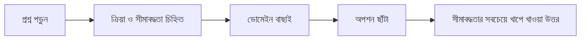

import KeywordTable from '../../../../components/content/KeywordTable.astro';
import ReferenceTable from '../../../../components/content/ReferenceTable.astro';
import Attribution from '../../../../components/content/Attribution.astro';
import MarkComplete from '../../../../components/progress/MarkComplete.astro';

> **Source:** SAA-C03 Exam Guide (v1.1), প্রিন্ট পেজ ১ (response types, distractor) ও ১৪–২৩ (appendix: technologies-and-concepts তালিকা) — প্যাটার্ন বিশ্লেষণ এই দুই অংশের সংশ্লেষ।

এই লেসনটি গাইডের দুই প্রান্তকে জোড়া লাগায়: পেজ ১-এর response types বলে প্রশ্ন *দেখতে* কেমন, আর appendix-এর technologies-and-concepts তালিকা বলে প্রশ্ন *কোথা থেকে* তৈরি হয়। দুটি একসঙ্গে ধরলে প্রশ্ন পড়ার একটি পদ্ধতি দাঁড়ায় — প্রথমে প্রশ্নের ক্রিয়া চেনা, তারপর ডোমেইন বাছাই, শেষে অপশন ছাঁটা।

## দুই ধরনের প্রশ্ন — কাঠামো

গাইডের ভাষায় পরীক্ষায় দুই ধরনের প্রশ্ন থাকে:

| ধরন | কাঠামো | পরীক্ষায় করণীয় |
| --- | --- | --- |
| **Multiple choice** | ১টি সঠিক + ৩টি distractor | একটিই অপশন বাছুন |
| **Multiple response** | ৫+ অপশনের মধ্যে ২+ সঠিক | সব সঠিক অপশন বাছুন — আংশিক নির্বাচনে পয়েন্ট নেই |

গাইডের সংজ্ঞা অনুযায়ী distractor হলো "অসম্পূর্ণ জ্ঞান বা দক্ষতার প্রার্থী যা বেছে নিতে পারে" এমন অপশন — অর্থাৎ এগুলো ভুল *তথ্য* নয়, বিষয়বস্তুর সঙ্গে মানানসই *সম্ভাব্য* উত্তর। তাই অপশন পড়ার সময় দুটি প্রশ্ন করুন: এটি কি প্রশ্নে চাওয়া সীমাবদ্ধতা পূরণ করছে, নাকি শুধু বিষয়টির সঙ্গে সম্পর্কিত?

## প্রশ্ন পড়ার তিন ধাপ

1. **ক্রিয়া ও সীমাবদ্ধতা চিহ্নিত করুন** — "design", "secure", "troubleshoot", "cost-optimize" জাতীয় ক্রিয়া আর "highly available", "most cost-effective", "least privilege" জাতীয় সীমাবদ্ধতা আলাদা করুন।
2. **ডোমেইন বাছাই করুন** — ক্রিয়া ও সীমাবদ্ধতা মিলিয়ে কোন ডোমেইনের task statement থেকে প্রশ্নটি এসেছে তা ঠিক করুন (নিচের টেবিল)।
3. **অপশন ছাঁটুন** — ডোমেইন নির্ধারিত হলে ভুল ডোমেইনের সমাধান দেওয়া অপশনগুলো প্রথমেই বাদ পড়ে; বাকিদের মধ্যে প্রশ্নের সীমাবদ্ধতাই চূড়ান্ত বাছাইয়ের মাপকাঠি।

## ক্রিয়া ও সীমাবদ্ধতা → ডোমেইন ম্যাপ

গাইডের task statement ও appendix-এর বিষয়-তালিকা মিলিয়ে সবচেয়ে ঘন ঘন আসা সংকেতগুলো:

<ReferenceTable
  columns={["প্রশ্নের সংকেত", "উদাহরণ শব্দ", "ডোমেইন", "ভাবনার দিক"]}
  rows={[
    ["Access control", "least privilege, IAM policy, federation", "ডোমেইন ১ — Secure", "ন্যূনতম অনুমতি, encryption, audit"],
    ["Workload protection", "WAF, Security Group, network ACL", "ডোমেইন ১ — Secure", "edge ও network স্তরের ফিল্টার"],
    ["High availability", "multi-AZ, failover, RTO/RPO", "ডোমেইন ২ — Resilient", "ব্যর্থতা সহ্য করা, decouple করা"],
    ["Scalability", "Auto Scaling, horizontal scaling", "ডোমেইন ২ — Resilient", "চাহিদা অনুযায়ী বাড়া-কমা"],
    ["Performance", "caching, throughput, latency", "ডোমেইন ৩ — High-Performing", "সঠিক storage/compute/database বাছাই"],
    ["Cost trade-off", "most cost-effective, minimize spend", "ডোমেইন ৪ — Cost-Optimized", "চাহিদা মেনে সবচেয়ে সাশ্রয়ী অপশন"],
  ]}
/>

এই ম্যাপ প্রশ্নের *বিষয়* নয়, *উদ্দেশ্য* চেনার জন্য — একই S3 প্রশ্ন cost-effective বললে ডোমেইন ৪-এর, durability বললে ডোমেইন ২-এর ভাবনায় যাবে।

## Distractor-এর তিন প্যাটার্ন

গাইডের সংজ্ঞা আর task statement-এর গড়ন মিলিয়ে তিনটি স্বাভাবিক প্যাটার্ন চেনা যায়:

1. **ভুল ডোমেইন, সঠিক সার্ভিস** — সমাধানটি আসলে কাজ করে, কিন্তু প্রশ্নের ক্রিয়া অন্য ডোমেইনের। যেমন highly available চাওয়া অবস্থায় শুধু cost কমানোর প্রস্তাব।
2. **সীমাবদ্ধতা ভাঙা** — প্রশ্নে বলা শর্ত (বাজেট, সময়, দক্ষতা, অপারেশনাল overhead) একটি অপশন অগ্রাহ্য করে। প্রশ্নের শেষ বাক্যের সীমাবদ্ধতা আলাদা করে পড়ুন।
3. **অতিরিক্ত জটিলতা** — কাজ করে এমন কিন্তু অপ্রয়োজনীয় সার্ভিস যোগ করা সমাধান; প্রশ্ন যেখানে "most operationally efficient" চায়, সেখানে সহজ ও পরিচালনাযোগ্য অপশনটিই জিতে।

## Exam trap

- **"অপশন বারবার পড়ে সঠিকটি খুঁজব"** — বরং প্রথমে ক্রিয়া ও সীমাবদ্ধতা চিহ্নিত করুন; ডোমেইন চিহ্নিত হলে অর্ধেক অপশন নিজেই বাদ।
- **"distractor মানে স্পষ্ট ভুল তথ্য"** — গাইডের সংজ্ঞায় এগুলো সম্ভাব্য ও বিষয়বস্তুর সঙ্গে মানানসই; "লম্বা/টেকনিক্যাল শোনাচ্ছে" তাই সঠিক, এমন অনুমান ভুল।
- **"multiple response-এ আংশিক নির্বাচন পয়েন্ট দেয়"** — গাইডে এমন কোনো আংশিক স্কোরিং নেই; সব সঠিক অপশন বাছতে হয়।
- **"প্রশ্নের ক্রিয়া দেখে সার্ভিস মুখস্থ মেলানো"** — ক্রিয়া শুধু ডোমেইন নির্দেশ করে; চূড়ান্ত বাছাই করে প্রশ্নের সীমাবদ্ধতা।

<KeywordTable keywords={frontmatter.keywords} />

<Attribution sourceUrl="https://d1.awsstatic.com/training-and-certification/docs-sa-assoc/AWS-Certified-Solutions-Architect-Associate_Exam-Guide.pdf" updated="2026-09-17" />

<MarkComplete lessonId="examguide-7" />
