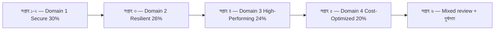

import KeywordTable from '../../../../components/content/KeywordTable.astro';
import Attribution from '../../../../components/content/Attribution.astro';
import MarkComplete from '../../../../components/progress/MarkComplete.astro';

> **Source:** SAA-C03 Exam Guide (v1.1), প্রিন্ট পেজ ১৪–২৩ (appendix — technologies and concepts, in-scope ও out-of-scope তালিকা)।

গাইডের মূল অংশ বলে *কী দক্ষতা* মাপা হয়; appendix বলে *কোন সার্ভিস ও বিষয়ে* সেই দক্ষতা আসবে। এই শেষ লেসনটি appendix-কে স্টাডি কম্পাস বানায়: কী শিখবেন, কী বাদ দেবেন আর কোন ক্রমে সাইটের দুটি কনটেন্ট থিমের সঙ্গে মেলাবেন।

## পরীক্ষায় আসতে পারে এমন ১৩টি বিষয়-এলাকা

গাইডের technologies-and-concepts তালিকা এই ১৩টি এলাকা নাম করে — গাইড স্পষ্ট সতর্ক করে যে ক্রম ও স্থান কোনো আপেক্ষিক গুরুত্ব নির্দেশ করে না:

Compute · Cost management · Database · Disaster recovery · High performance · Management and governance · Microservices and component delivery · Migration and data transfer · Networking, connectivity, and content delivery · Resiliency · Security · Serverless and event-driven design principles · Storage

এলাকাগুলো চার ডোমেইনে সরাসরি মেলে না — বরং ডোমেইনগুলোকে অতিক্রম করে পুরো পরীক্ষার শব্দভাণ্ডার। যেমন Microservices and component delivery ও Serverless প্রিন্সিপাল মূলত সাইটের মাইক্রোসার্ভিসেস থিমের পাঠ্য।

## In-scope তালিকা — পাঠ্যসূচি

গাইডের in-scope তালিকা বিভাগভিত্তিক; নিচে প্রতিটি বিভাগের সংখ্যা আর পরীক্ষার দৃষ্টিতে সবচেয়ে ভারী উদাহরণ:

| বিভাগ | সংখ্যা | পরীক্ষার দৃষ্টিতে গুরুত্বপূর্ণ উদাহরণ |
| --- | ---: | --- |
| Analytics | ১১ | Kinesis, Athena, Redshift |
| Application Integration | ৭ | SQS, SNS, EventBridge, Step Functions |
| Cost Management | ৪ | Cost Explorer, Budgets, Savings Plans |
| Compute | ৮ | EC2, Auto Scaling, Lambda (Serverless বিভাগে), Elastic Beanstalk |
| Containers | ৬ | ECS, EKS, ECR |
| Database | ১০ | RDS, Aurora, DynamoDB, ElastiCache |
| Developer Tools | ১ | X-Ray |
| Front-End Web and Mobile | ৪ | API Gateway, Amplify |
| Machine Learning | ১৩ | বেশিরভাগই সার্ভিস-নাম চেনা যথেষ্ট |
| Management and Governance | ১৯ | CloudWatch, CloudTrail, Organizations, Systems Manager |
| Media Services | ২ | Elastic Transcoder, Kinesis Video Streams |
| Migration and Transfer | ৭ | DMS, DataSync, Snow Family |
| Networking and Content Delivery | ১০ | VPC, Route 53, CloudFront, ELB, Transit Gateway |
| Security, Identity, and Compliance | ১৭ | IAM, KMS, WAF, Shield, Cognito, Secrets Manager |
| Serverless | ৩ | Lambda, Fargate, AppSync |
| Storage | ৭ | S3, EBS, EFS, FSx, S3 Glacier, Storage Gateway |

গাইডের ভাষায় তালিকাটি **non-exhaustive** — অর্থাৎ পরীক্ষায় তালিকার বাইরের কিছুও চলে আসতে পারে এবং তালিকা সময়ের সঙ্গে বদলায়।

## Out-of-scope তালিকা — বাদ-সূচি

সমান গুরুত্বপূর্ণ: কী *পড়তে হবে না*। গাইডের out-of-scope তালিকার বিভাগ ও উদাহরণ:

| বিভাগ | উদাহরণ |
| --- | --- |
| Analytics | CloudSearch |
| Application Integration | MWAA |
| AR/VR, Blockchain, Game Tech, Robotics, Satellite, Quantum | Sumerian, Managed Blockchain, GameLift, RoboMaker, Ground Station, Braket |
| Compute | Lightsail |
| Database | RDS on VMware |
| Developer Tools | CodeBuild, CodeDeploy, CodeCommit, CDK, Cloud9, CodeStar |
| Internet of Things | সব সার্ভিস |
| Machine Learning | SageMaker-এর গভীর টুলিং (Ground Truth, Data Wrangler), DeepRacer, Inferentia |
| Management and Governance | OpsWorks, AWS Chatbot |
| Media Services | Elemental MediaLive/MediaConvert পরিবার |
| Migration and Transfer | Migration Evaluator |
| Networking | App Mesh, Cloud Map |

**OpsWorks বাইরে** — মনে রাখুন, ব্লু/গ্রিন থিমের পাঠ ৭-এ OpsWorks ছিল ওয়াইটপেপারের বিষয়, কিন্তু SAA-C03 পরীক্ষার স্কোপের বাইরে। ওয়াইটপেপার আর পরীক্ষা — দুটি ভিন্ন দলিলের স্কোপ ভিন্ন।

## ছয় সপ্তাহের রোডম্যাপ

ওয়েটিং (৩০/২৬/২৪/২০) অনুযায়ী সময় ভাগ করা একটি কাঠামো — আপনার দৈনিক সময় অনুযায়ী ছাঁটুন:

- **সপ্তাহ ১–২ — ডোমেইন ১ (Secure):** সাইটের [মাইক্রোসার্ভিসেস](/aws-solution-architect-associate-resources/learn/microservices/) থিমের CI/CD ও private networking পাঠ + IAM, KMS, WAF-এর মৌলিক ব্যবহার।
- **সপ্তাহ ৩ — ডোমেইন ২ (Resilient):** [ব্লু/গ্রিন থিম](/aws-solution-architect-associate-resources/learn/blue-green/)ের DR/HA পাঠ ৯ + SQS/SNS decoupling।
- **সপ্তাহ ৪ — ডোমেইন ৩ (High-Performing):** storage class, ElastiCache, read replica — মাইক্রোসার্ভিসেস থিমের caching পাঠ।
- **সপ্তাহ ৫ — ডোমেইন ৪ (Cost-Optimized):** Spot, Savings Plans, S3 lifecycle — সবচেয়ে হালকা ডোমেইন, তাই এক সপ্তাহ।
- **সপ্তাহ ৬ — মিশ্র রিভিশন:** [প্রশ্ন-প্যাটার্ন লেসন](/aws-solution-architect-associate-resources/learn/exam-guide/7-question-patterns/)ের তিন-ধাপ পদ্ধতি প্র্যাকটিস প্রশ্নে প্রয়োগ, দুর্বল task statement পুনরাবৃত্তি।

প্রতি সপ্তাহের শেষে **skill gap review** — সেই সপ্তাহের ডোমেইনের task statement আরও একবার পড়ুন আর নিজেকে জিজ্ঞেস করুন: এই task-এর একটি সিনারিও প্রশ্ন আমি কীভাবে ভেবে উত্তর দেব?

## Exam trap

- **"in-scope তালিকার বাইরে কিছু আসবে না"** — গাইড নিজেই বলে তালিকা non-exhaustive; এটি চেকলিস্ট, সীমানা নয়।
- **"appendix-এর ১৩ এলাকা ডোমেইনের weighting অনুসরণ করে"** — তালিকার ক্রম ও স্থান কোনো গুরুত্ব নির্দেশ করে না — গাইডের স্পষ্ট সতর্কতা।
- **"OpsWorks পরীক্ষায় আসে"** — ব্লু/গ্রিন ওয়াইটপেপারের বিষয়, কিন্তু SAA-C03-এর out-of-scope তালিকায়।
- **"সব ML সার্ভিস গভীরভাবে শিখতে হবে"** — in-scope ML বিভাগের বেশিরভাগ সার্ভিসের জন্য কাজ-স্তরের ধারণা যথেষ্ট; গভীর ML টুলিং (Ground Truth, Data Wrangler) out-of-scope।
- **"out-of-scope তালিকা স্থায়ী"** — দুই তালিকাই বদলায়; পরীক্ষার আগে বর্তমান exam guide যাচাই করুন।

<KeywordTable keywords={frontmatter.keywords} />

<Attribution sourceUrl="https://d1.awsstatic.com/training-and-certification/docs-sa-assoc/AWS-Certified-Solutions-Architect-Associate_Exam-Guide.pdf" updated="2026-09-17" />

<MarkComplete lessonId="examguide-8" />
