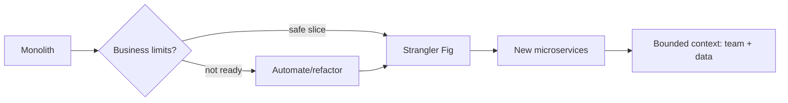

import KeywordTable from '../../../../components/content/KeywordTable.astro';
import Attribution from '../../../../components/content/Attribution.astro';
import MarkComplete from '../../../../components/progress/MarkComplete.astro';

> **Source:** Implementing Microservices on AWS, প্রিন্ট পেজ ১–৩ (title page, abstract, introduction, Well-Architected ও modernization)।

## কেন এই whitepaper?

Microservices ছোট, loosely coupled services-এর সমষ্টি। প্রতিটি service নিজস্ব deployment, scaling ও team ownership পায় এবং well-defined API দিয়ে যোগাযোগ করে। এতে scalability, resilience, flexibility ও development speed বাড়ে।

Whitepaper-এ API-driven, event-driven ও data-streaming pattern দেখানো হয়। কিন্তু microservices সব প্রজেক্টের উত্তর নয়—scale, complexity ও use case অনুযায়ী monolith বা hybrid approach ভালো হতে পারে।

## মূল keywords

- **Agile + SOA + API-first + CI/CD**: আধুনিক microservice design-এর ভিত্তি।
- **Twelve-Factor App**: configuration, statelessness ও reproducibility-র প্রচলিত নিয়ম।
- **Case-by-case decision**: microservices বনাম monolith নির্ধারণে cost ও complexity দেখুন।
- **Serverless principles**: infrastructure ছাড়া, consumption-ভিত্তিক scaling, pay-for-value ও built-in availability।
- **Scope**: AWS Cloud; hybrid/migration strategy এই whitepaper-এ নেই।

## Well-Architected কীভাবে সাহায্য করে

AWS Well-Architected Framework ছয়টি pillar দিয়ে cloud system-এর ডিজাইন trade-off বোঝায়: security, operational excellence, reliability, performance efficiency, cost optimization ও sustainability। AWS Well-Architected Tool free এবং console থেকে workload review করা যায়। Serverless Application Lens serverless-নির্দিষ্ট best practices প্রদান করে।

## Modernization

Microservices হলো application-এর ছোট independent unit। Monolith ভাঙা এক ধাপে করা যায় না। **Strangler Fig** pattern ব্যবহার করে নতুন capabilities আলাদা service-এ নিয়ে আসা যায়, পুরনো system ধীরে কমানো যায় এবং প্রতিটি ধাপ rollback-friendly রাখা যায়। **Bounded Context** ব্যবহার করলে service সীমা ব্যবসায়িক ক্ষমতার সাথে মিলে যায়, অন্তর্নিহিত data model দিয়ে চাপানো যায় না।

## Exam traps

- Microservices সবসময় ভালো নয়; trade-off হলো operational complexity, observability ও team maturity।
- Serverless মানে “কোড নেই” নয়; মানে infrastructure আপনাকে manage করতে হয় না।
- Modernization এক সাথে migration নয়; incremental, measurable ও reversible step নেওয়া উত্তম।

<KeywordTable keywords={frontmatter.keywords} />

<Attribution sourceUrl={frontmatter.sourceUrl} updated={frontmatter.updated} />
<MarkComplete lessonId="microservices-1" />
