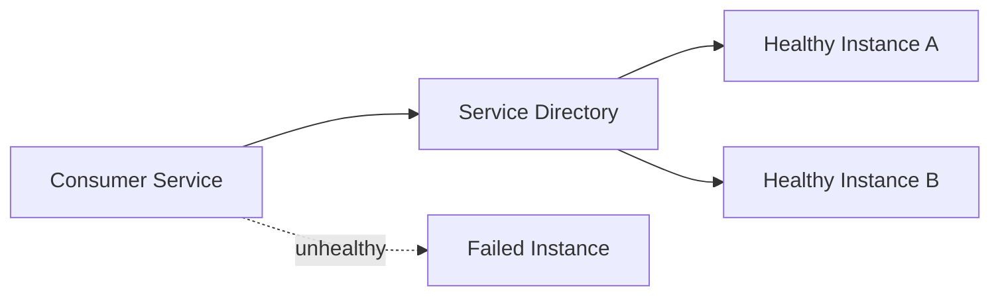
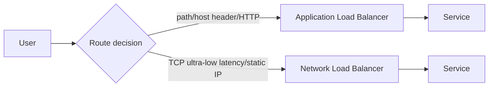

import ExamTrap from '../../../../components/content/ExamTrap.astro';
import KeywordTable from '../../../../components/content/KeywordTable.astro';
import Attribution from '../../../../components/content/Attribution.astro';
import MarkComplete from '../../../../components/progress/MarkComplete.astro';

> **Source:** Implementing Microservices on AWS, প্রিন্ট পেজ ১৫–১৭ (Distributed systems components)।

## কেন service discovery দরকার?

Microservices dynamic HTTP/TCP endpoints দিয়ে চলে এবং auto scaling/hot swap-এর পরে নতুন instance সেটআপ হতে পারে। কিন্তু consumer services কোন instance এ পাঠাবে তা জানার দরকার হয়। **Service discovery** সে জন্য DNS-based registry/service registry আনে।

- fixed IP না রেখে service name দিয়ে connect করুন।
- health check থাকলে unhealthy instance সরান।
- dynamic scaling এবং container task replacement-এর কথা মাথায় রাখুন।

## API layer ও messaging

Microservices messaging সাধারণত নিম্নলিখিত কাজ করে:

- request routing বা reverse proxy।
- client response-time latency কমানো।
- service-to-service mesh এ policy apply করা।
- authentication/authorization।
- metrics, logging, tracing, retry, circuit breaking ও cache।

**Amazon API Gateway** এই দায়িত্বগুলো একসাথে করে দেয়: traffic management, authorization, rate limiting, monitoring। change খুব বেশি হলে আরও সাধারণ মাধ্যম হলো Application Load Balancer, Envoy/ALB বা custom reverse proxy।

## Load balancers

- **Application Load Balancer**: HTTP/HTTPS, path/host rules, websocket, gRPC, listener rules।
- **Network Load Balancer**: high throughput, static IP, TCP/UDP, low latency।
- **Gateway Load Balancer**: third-party network virtual appliance traffic flow।

## Network ও private service

- **VPC** হলো logical private network; subnet-এ data/placement ভাগ হয়।
- **VPC Endpoint** supported AWS services-এ private connection।
- **AWS PrivateLink** VPCs and AWS services-এর মধ্যে interface।
- **Network ACL** subnet level; stateless allow/deny rules।
- **Security Group** instance-level; stateful allow rules।

AWS PrivateLink VPC endpoint services ও shared services security বাড়ায়। Traffic public internet পার হয় না।

## Service mesh বা front door?

Service mesh একটি dedicated infrastructure লেয়ার, যেখানে sidecar/gateway proxy-এর মাধ্যমে service-to-service connection, traffic shaping, mTLS, retries ও observability পরিচালিত হয়। API Gateway সাধারণত external API-গুলোর front door। একটি architecture-এ দুটি একসাথে থাকতে পারে।

<ExamTrap title="Service discovery বনাম load balancing" question="Fixed IP-এর পরিবর্তে কী ব্যবহার করবেন?" answer="Service discovery + health checks। Sizing ও host replacement-এর কারণে instance IP গুলো প্রায়ই বদলে যায়।" />

<KeywordTable keywords={frontmatter.keywords} />

<Attribution sourceUrl={frontmatter.sourceUrl} updated={frontmatter.updated} />
<MarkComplete lessonId="microservices-10" />
