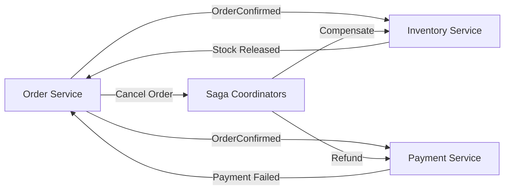

import KeywordTable from '../../../../components/content/KeywordTable.astro';
import Attribution from '../../../../components/content/Attribution.astro';
import MarkComplete from '../../../../components/progress/MarkComplete.astro';

Monolith এক database share করতে পারে, কিন্তু microservice সাধারণত নিজস্ব data ownership রাখে। এখানে challenge হলো service গুলোতে একসাথে সঠিক state রাখা, বিশেষ করে payment, inventory বা order মতো workflow-এ।

## Patterns দেখুন

- **Event-driven messaging** service decoupling করে। EventBridge/SNS তে ঘটনা occur করে, অন্য service react করে।
- **Saga** বহু service ধাপে ধাপে orchestrate করে। Failure হলে compensating action চালায়।
- **Event sourcing** current state না রেখে সব state change event রাখে। Replay করে state তৈরি করা যায়।
- **CQRS** আলাদা write model আর fast read model রাখে। This is often useful with high read throughput.
- **Idempotency** রিট্রাই বা duplicate event নিরাপদ করে, যেমন same payment ID দুই বার process না করা।

> [!NOTE]
> প্রশ্নে "atomic transaction across microservices" এর বদলে "compensating action", "eventual consistency", "rollback sequence" শেখা সহজ।

> [!NOTE]
> মাইক্রোসার্ভিস এ two-phase commit সহজে করা যায় না। বহু service across workflow সাধারণত Saga দিয়ে সামলায়; এতে eventual consistency এবং compensation mechanism থাকে।

<KeywordTable keywords={frontmatter.keywords} />

<Attribution sourceUrl={frontmatter.sourceUrl} updated={frontmatter.updated} />
<MarkComplete lessonId="microservices-11" />
