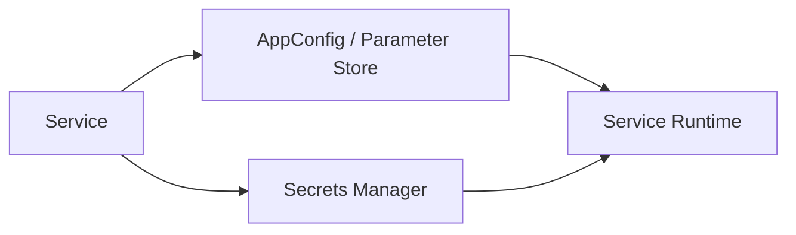

import KeywordTable from '../../../../components/content/KeywordTable.astro';
import Attribution from '../../../../components/content/Attribution.astro';
import MarkComplete from '../../../../components/progress/MarkComplete.astro';

> **Source:** Implementing Microservices on AWS, প্রিন্ট পেজ ১৯ (Configuration ও secrets management)।

এক microservice ভিন্ন environment, region ও tenant-এ চলে; তাই hardcoded config দ্রুত সমস্যা তৈরি করে। Lambda environment variables এবং container variables সত্যিই useful, কিন্তু shared config রাখলে আপডেট ধারাবাহিক হয় না।

## Core services

- **AWS AppConfig** dynamic configuration বা feature flag deploy করে। Configuration validators সেট করা যায়।
- **Parameter Store** configuration value, API key বা non-sensitive values রাখে; secure value রাখতে SecureString।
- **Secrets Manager** password, database credential, OAuth token রাখে; বিশেষ সুবিধা হলো automatic rotation।
- **Kubernetes** EKS এ Kubernetes Secret/ConfigMap মানানসই; External Secrets Operator বা CSI driver AWS secrets sync করে।
- Parameter path দিয়ে service ও environment একসাথে organize করা সহজ: `/microservice/payments/dev/db_url`।

> [!NOTE]
Parameter Store এবং Secrets Manager দুটিই sensitive value রাখতে পারে, কিন্তু Secrets Manager automatic credential rotation ও cross-region replication সাপোর্ট দেয়।

<KeywordTable keywords={frontmatter.keywords} />

<Attribution sourceUrl={frontmatter.sourceUrl} updated={frontmatter.updated} />
<MarkComplete lessonId="microservices-12" />
