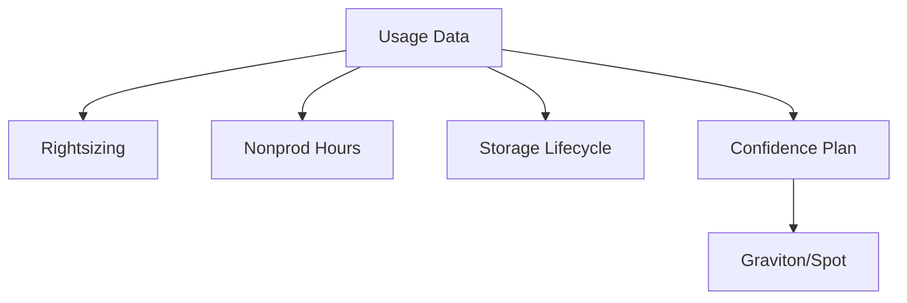

import KeywordTable from '../../../../components/content/KeywordTable.astro';
import Attribution from '../../../../components/content/Attribution.astro';
import MarkComplete from '../../../../components/progress/MarkComplete.astro';

Microservices এবং serverless খরচ নিয়ন্ত্রণে সাহায্য করে, কারণ সার্ভিস গুলো আলাদা হয় এবং শুধু ব্যবহৃত অংশের cost দিতে হয়। তবে বহু ছোট সার্ভিস বানানো নিজে থেকে cost win নয়।

> **Source:** Implementing Microservices on AWS, প্রিন্ট পেজ ২০ (Cost optimization ও sustainability)।

## Cost levers

- বেশি load ধারণ করা সার্ভিসকে স্কেল করুন, বাকিদের low baseline এ রাখুন।
- Lambda/Fargate/App Runner এ exact resources স্কেল করা হয়; idle cost কম।
- Batch, CI বা fault-tolerant workload-এ Spot Instances ব্যবহার করা যায়।
- Graviton processor অনেক workload এ performance-per-dollar better হয়, কিন্তু library compatibility check দরকার।
- Regulating ephemeral files, logs এবং lifecycle policy বছরের পর বছর খরচ কমায়।
- AWS Cost Explorer দিয়ে environment, service ও tag filter এ demand pattern বোঝা যায়।

> [!NOTE]
প্রশ্ন যদি "টাকা কমাও" বলে, তবু SLA/availability/concurrency ভুলে গেলে ভুল। Cost কমানোর একটি সিদ্ধান্ত নিন, কিন্তু business requirement মাথায় রাখুন।

<KeywordTable keywords={frontmatter.keywords} />

<Attribution sourceUrl={frontmatter.sourceUrl} updated={frontmatter.updated} />
<MarkComplete lessonId="microservices-13" />
