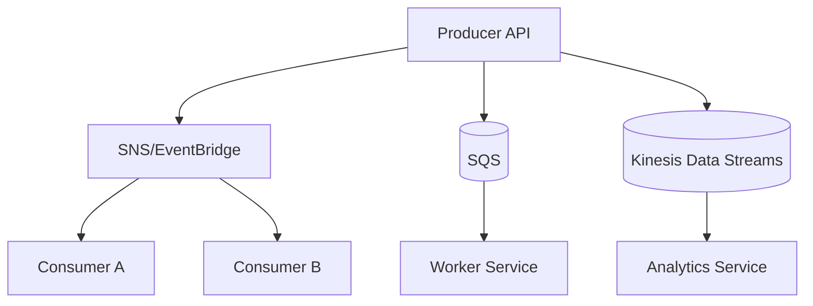

import KeywordTable from '../../../../components/content/KeywordTable.astro';
import Attribution from '../../../../components/content/Attribution.astro';
import MarkComplete from '../../../../components/progress/MarkComplete.astro';

Microservices communication দুই দিকে ভাগ করুন: সরাসরি API call (synchronous) এবং ইভেন্ট পাঠিয়ে (asynchronous)। ভুল লক্ষ্য হলো সব কিছু এক প্যাটার্ন দিয়ে সমাধান করা।

> **Source:** Implementing Microservices on AWS, প্রিন্ট পেজ ২১–২২ (Communication mechanisms)।

## Sync প্যাটার্ন

- **REST/API Gateway** public and third-party API, mobile/web backend, cacheability।
- **GraphQL** single endpoint থেকে client নিজের data shape নির্বাচ করে; অনেক frontend field combination দরকার হলে কাজ করে।
- **gRPC** service-to-service বহু call, binary serialization এবং contract-first API-তে ভালো। AppSync বা ALB/Envoy-সহ মানানসই।
- **WebSocket** bidding, chat, notifications, live scores।
- Service discovery/http client timeout এবং retries সেট করতে হয়।

## Async প্যাটার্ন

- **SQS** queue: এক consumer group; spiky load মসৃণ করে। Standard queue-তে high throughput কিন্তু duplicate delivery সম্ভব; FIFO-তে ordering ও কম duplication।
- **SNS** topic fanout: এক event → Lambda, SQS, email, HTTP consumers।
- **EventBridge** event buses: schema registry, rule routing, event archive/replay, third-party SaaS integration।
- **Kinesis Data Streams** ordered high throughput, analytics and consumer lag monitoring।
- **MSK/MQ** Kafka/RabbitMQ/ActiveMQ compatibility; workload-নির্দিষ্ট কাজে।

> [!NOTE]
SNS fanout কি SQS-এর বিকল্প? Fanout-এ এক publisher, একাধিক consumer। Queue-তে consumer একটাই group। EventBridge-এ rule-based routing দরকার। প্রশ্নে "fanout" আর "queue" শব্দ খেয়াল রাখুন।

<KeywordTable keywords={frontmatter.keywords} />

<Attribution sourceUrl={frontmatter.sourceUrl} updated={frontmatter.updated} />
<MarkComplete lessonId="microservices-14" />
