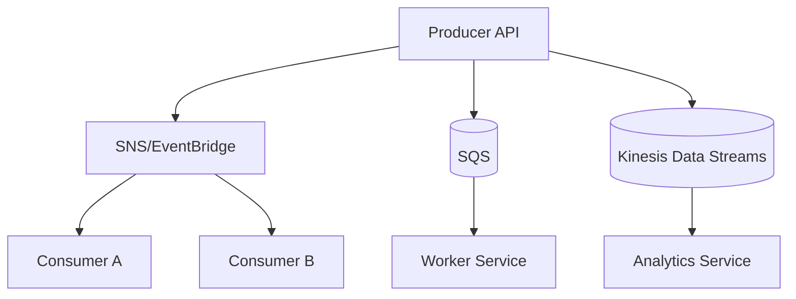

import KeywordTable from '../../../../components/content/KeywordTable.astro';
import Attribution from '../../../../components/content/Attribution.astro';
import MarkComplete from '../../../../components/progress/MarkComplete.astro';

Microservices communication দুই দিকে ভাগ করুন: সরাসরি API call (synchronous) এবং টিকটিক পাঠানো বা ইভেন্টের ভিত্তিতে (asynchronous)। ভুল লক্ষ্য হলো সব কিছু এক প্যাটার্ন দিয়ে সমাধান করা।

## Sync প্যাটার্ন

- **REST/API Gateway** public and third-party API, mobile/web backend, cacheability।
- **GraphQL** single endpoint থেকে client নিজের data shape নির্বাচ করে; অনেক frontend field combination দরকার হলে কাজ করে।
- **gRPC** service-to-service বহু call, binary serialization এবং contract-first API. Lambda এ সা৾াv姗়, Apps এ মানানসই।
- **WebSocket** bidding, chat, notifications, live scores।
- Service discovery/http client timeout এবং retries সেট করতে হয়।

## Async প্যাটার্ন

- **SQS** queue: one consumer group; smooth spiky load। Standard queue high throughput but duplicate delivery possible; FIFO ordering/low duplication।
- **SNS** topic fanout: এক event → Lambda, SQS, email, HTTP consumers।
- **EventBridge** event buses: schema registry, rule routing, event archive/replay, third-party SaaS integration।
- **Kinesis Data Streams** ordered high throughput, analytics and consumer lag monitoring।
- **MSK/MQ** Kafka/RabbitMQ/ActiveMQ compatibility, workload-specific use cases।

> [!NOTE]
SNS fanout event alternative to SQS? Fanout needs एक publisher, multiple consumers। Queue consumer single group। EventBridge এ rule based routing needed। প্রশ্নে "fanout" আর "queue" সা০য়া শব্দ।

<KeywordTable keywords={frontmatter.keywords} />

<Attribution sourceUrl={frontmatter.sourceUrl} updated={frontmatter.updated} />
<MarkComplete lessonId="microservices-14" />
