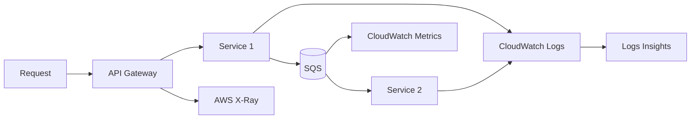

import KeywordTable from '../../../../components/content/KeywordTable.astro';
import Attribution from '../../../../components/content/Attribution.astro';
import MarkComplete from '../../../../components/progress/MarkComplete.astro';

Microservices-এ request এক API থেকে বহু সার্ভিস, queue এবং data store-এ যেতে পারে। তাই per-service debugging যথেষ্ট নয়; end-to-end path দ্রুত দেখা জরুরি।

> **Source:** Implementing Microservices on AWS, প্রিন্ট পেজ ২৬–৩২ (Observability — monitoring, logs ও tracing)।

## Three pillars to remember

- **Metrics:** throughput, latency, error rate, queue depth, CPU/memory।
- **Logs:** request logs, business logs, exception traceback; high cardinality data।
- **Traces:** AWS X-Ray/OpenTelemetry with `b3` or `traceparent` context propagation।
- **Events:** EventBridge/SNS/SQS event-গুলো consumer failure পর্যন্ত track করা উচিত।
- **Service dashboard:** UI/API request থেকে database latency পর্যন্ত user journey-ভিত্তিক দৃশ্য।

## AWS tools

- CloudWatch logs, metrics, alarms, dashboards ও Logs Insights।
- OpenSearch log analysis ও dashboard তৈরিতে কাজ করে।
- CloudWatch Synthetics canaries critical user flow নিয়মিত verify করে।
- AWS X-Ray service map, traces ও segment/subsegment instrumentation দেয়।
- SNS বা EventBridge alert routing করে; on-call integration হয় Slack/PagerDuty-তে।
- CloudTrail management-plane audit — এটি runtime observability নয়।

> [!NOTE]
CloudWatch Logs নির্দিষ্ট issue ব্যাখ্যা করতে সাহায্য করে, কিন্তু "কোন সার্ভিসে latency বাড়ল?" — এমন প্রশ্নে distributed tracing, অর্থাৎ X-Ray প্রায়ই সরাসরি উত্তর।

<KeywordTable keywords={frontmatter.keywords} />

<Attribution sourceUrl={frontmatter.sourceUrl} updated={frontmatter.updated} />
<MarkComplete lessonId="microservices-16" />
