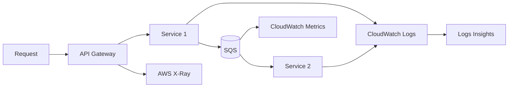

import KeywordTable from '../../../../components/content/KeywordTable.astro';
import Attribution from '../../../../components/content/Attribution.astro';
import MarkComplete from '../../../../components/progress/MarkComplete.astro';

Microservices এ request এক(expr) API থেকে বহু সার্ভিস, queue এবং data store এ যেতে পারে। তাই per-service debugging কেবল সমস্যা নয়; একজন দ্রুত end-to-end path দেখা জরুরি।

## Three pillars to remember

- **Metrics:** throughput, latency, error rate, queue depth, CPU/memory।
- **Logs:** request logs, business logs, exception traceback; high cardinality data।
- **Traces:** AWS X-Ray/OpenTelemetry with `b3` or `traceparent` context propagation।
- **Events/depends:** EventBridge/SNS/SQS events should be tracked through consumer failures।
- **Service dashboard:** user journey level from UI/API request to database latency.

## AWS tools

- CloudWatch logs, metrics, alarms, dashboards, Logs Insights।
- OpenSearch খারাপ logstütze/creating dashboards।
- CloudWatch Synthetics canaries critical usable flows regular verify করে।
- AWS X-Ray service map, traces and segment/subsegment instrumentation।
- SNS or EventBridge alert routing; On-call integration Slack/PagerDuty.
- CloudTrail management-plane audit এর সাথে সাথে observability নয়।

> [!NOTE]
CloudWatch Logs খারাপ issue গুলো ব্যাখ্যা করতে সাহায্য করে, কিন্তু "where did latency increase across services?" এর ভিত্তিতে distributed tracing প্রায়ই সরাসরি X-Ray।

<KeywordTable keywords={frontmatter.keywords} />

<Attribution sourceUrl={frontmatter.sourceUrl} updated={frontmatter.updated} />
<MarkComplete lessonId="microservices-16" />
