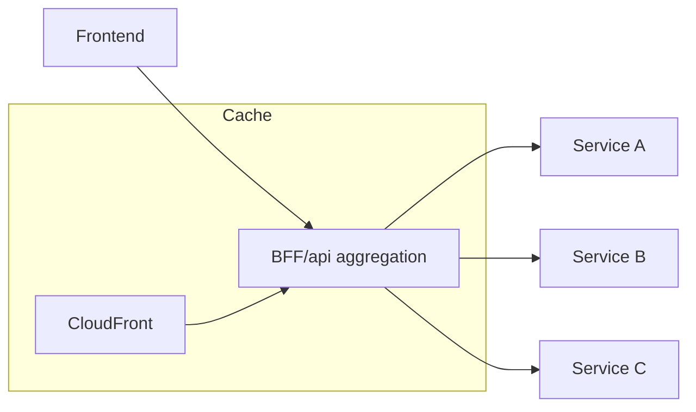

import KeywordTable from '../../../../components/content/KeywordTable.astro';
import Attribution from '../../../../components/content/Attribution.astro';
import MarkComplete from '../../../../components/progress/MarkComplete.astro';

Excessive communication cross-domain is the common root cause of latency/security problems. Service-to-service calls should be minimized and moved to message queues when possible।

## Strategies

- Aggregate multiple service responses into one backend-for-frontend endpoint।
- Cache static/common data at CloudFront or service level।
- Asynchronous workflows via SQS/SNS/EventBridge instead of tight HTTP calls।
- gRPC/protobuf reduce payload overhead for high-volume internal RPC।
- Retries and exponential backoff to avoid amplification cascading。
- Malformed data should fail fast; validate request schema at API layer।

> [!NOTE]
Large microservices team গুলো প্রায়ই blindly tightly couple HTTP calls করে। এটি temporal coupling বাড়ায়; async messaging হলে producer/contributor independent। এক API endpoint পেও অগ্রগতি প্রয়োজন।

<KeywordTable keywords={frontmatter.keywords} />

<Attribution sourceUrl={frontmatter.sourceUrl} updated={frontmatter.updated} />
<MarkComplete lessonId="microservices-17" />
