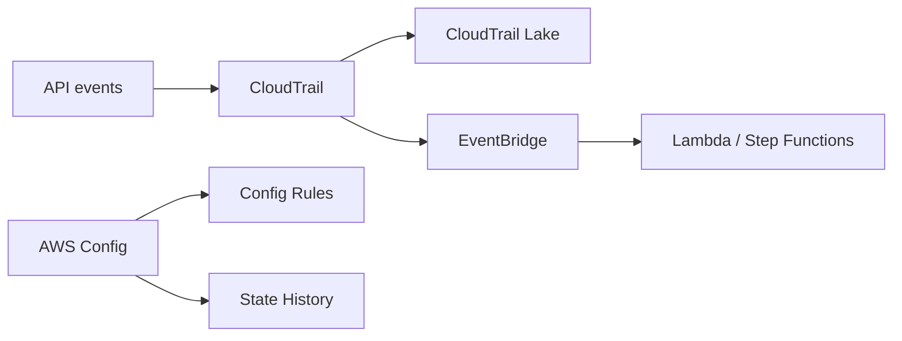

import KeywordTable from '../../../../components/content/KeywordTable.astro';
import Attribution from '../../../../components/content/Attribution.astro';
import MarkComplete from '../../../../components/progress/MarkComplete.astro';

Microservices এ বহু টিম, account এবং automated changes থাকে। Compliance, troubleshooting এবং responsibility চিহ্নিত করতে auditable trail রাখা জরুরি।

## What records what

- **CloudTrail** API/event record; caller identity, resource, request/response metadata, source IP, timestamp।
- **CloudTrail Lake** audit data lake; SQL query দিয়ে investigate centrally।
- **AWS Config** current state, config history, resource relationships, compliance drift।
- **Config rules** specific setting check; custom rules/Lambda evaluate।
- **EventBridge** CloudTrail event match → SNS/Lambda/Step Functions automation।
- **GuardDuty/Detective/Security Hub** security context এ ব্যবহার হয়।

> [!NOTE]
CloudTrail বলে "who did what"; Config বলে "what changed and how it looks now"। প্রশ্নে difference দেখাতে জানতে হবে।

<KeywordTable keywords={frontmatter.keywords} />

<Attribution sourceUrl={frontmatter.sourceUrl} updated={frontmatter.updated} />
<MarkComplete lessonId="microservices-18" />
