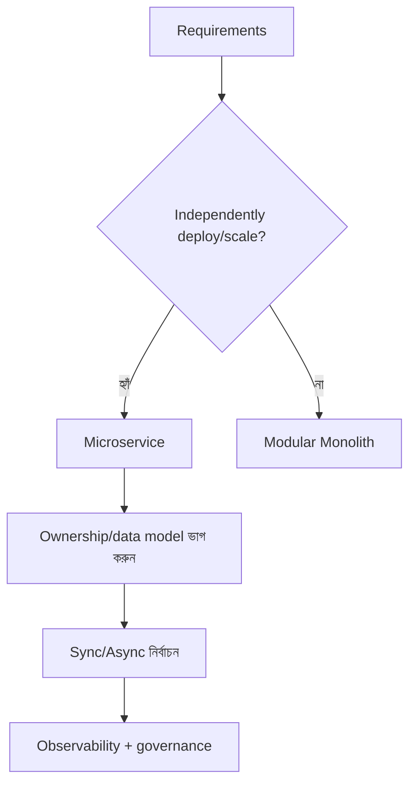

import KeywordTable from '../../../../components/content/KeywordTable.astro';
import Attribution from '../../../../components/content/Attribution.astro';
import MarkComplete from '../../../../components/progress/MarkComplete.astro';

Microservices শুধু technology নয়; এটি organization, data ownership, deployment এবং observability পরিবর্তন সৃষ্টি করে। এই বোঝাপড়া AWS service নির্বাচন ও প্রশ্ন বোঝাকে সহজ করে।

## Decision questions

- কি workload আলাদাভাবে deploy/scale হবে? Microservice / event-driven design ভাবুন।
- কি service-to-service policy, connection and auth সহজ হতে হবে? VPC Lattice/App Mesh/service mesh।
- কি access control, resource governance ও business workflow রাখা দরকার? IAM, Resource policy, CloudTrail।
- কি usage based scaling প্রয়োজন? Lambda/Fargate বা managed services।
- কি eventual consistency এবং rollback strategy প্রয়োজন? Saga and event sourcing patterns।

> [!NOTE]
"Microservice দরকার" — এটা প্রথম উত্তর হওয়া উচিত নয়। প্রশ্নে domain boundary ও deployment/release cycle ভাবতে হবে।

<KeywordTable keywords={frontmatter.keywords} />

<Attribution sourceUrl={frontmatter.sourceUrl} updated={frontmatter.updated} />
<MarkComplete lessonId="microservices-19" />
