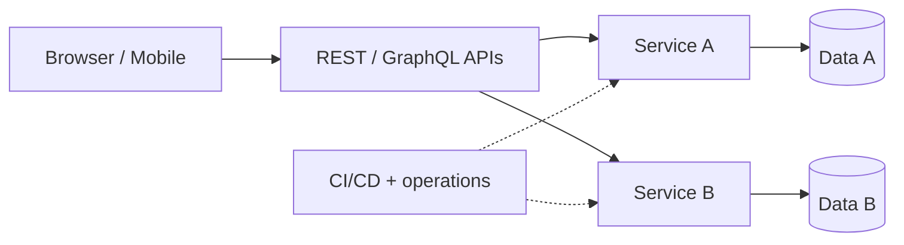

import KeywordTable from '../../../../components/content/KeywordTable.astro';
import Attribution from '../../../../components/content/Attribution.astro';
import MarkComplete from '../../../../components/progress/MarkComplete.astro';

> **Source:** Implementing Microservices on AWS, প্রিন্ট পেজ ৪ (architecture ও User interface)।

Reference architecture-কে আলাদা layers-এ ভেবে মনে রাখুন: user interface, API/microservices layer, service-owned data ও operations। Static web content ব্যবহারকারীর কাছে পৌঁছাতে Amazon S3 এবং Amazon CloudFront ব্যবহৃত হয়। REST বা GraphQL APIs সাধারণত application logic-এর প্রবেশপথ হয়।

## API layer

API হলো microservices-এর **front door**। এর কাজ শুধু protocol forward করা নয়: traffic management, request filtering, routing, caching, authentication ও authorization এখানেই প্রয়োগ হয়।

> **Exam shortcut:** global static delivery মানে S3 + CloudFront; managed API front door + auth/throttling মানে API Gateway; path/host-based HTTP routing মানে ALB।

<Attribution sourceUrl={frontmatter.sourceUrl} updated={frontmatter.updated} />
<MarkComplete lessonId="microservices-2" />
