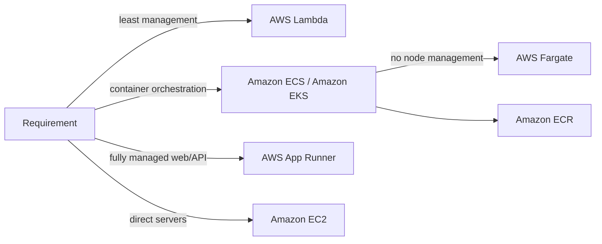

import KeywordTable from '../../../../components/content/KeywordTable.astro';
import Attribution from '../../../../components/content/Attribution.astro';
import MarkComplete from '../../../../components/progress/MarkComplete.astro';

> **Source:** Implementing Microservices on AWS, প্রিন্ট পেজ ৫ (Microservices ও Microservices implementations)।

## API কেন “front door”?

API application logic-এর entry point। প্রচলিত REST/GraphQL API গুলো client calls manage করে: traffic management, request filtering, routing, caching, authentication ও authorization।

## Compute choice = infrastructure control choice

- **AWS Lambda**: code upload করলে scaling ও execution উচ্চ availability দিয়ে manage হয়; multiple languages এবং AWS event triggers supported।
- **Containers**: portability, productivity ও efficiency-র কারণে জনপ্রিয়।
- **App2Container (A2C)**: Java/.NET web application analyze/inventory করে container format-এ migration/modernization tool।
- **Amazon EKS**: managed Kubernetes; Kubernetes community plug-ins/tooling এবং EKS Anywhere দরকার হলে উপযুক্ত।
- **Amazon ECS**: fully managed container orchestration; AWS integration ও operational simplicity-তে ভালো।
- **AWS App Runner**: infrastructure/container expertise ছাড়া container web/API application deploy ও run।
- **AWS Fargate**: ECS ও EKS-এর সাথে কাজ করা serverless compute engine।
- **Amazon ECR**: fully managed, high-performance container registry।

> **Exam shortcut:** management কমানোর ধারা হলো EC2 → ECS/EKS on EC2 → ECS/EKS on Fargate → Lambda/App Runner। Kubernetes ecosystem মানে EKS; AWS-native simplicity মানে ECS।

<Attribution sourceUrl={frontmatter.sourceUrl} updated={frontmatter.updated} />
<MarkComplete lessonId="microservices-3" />
