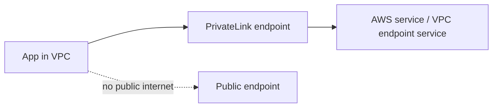

import KeywordTable from '../../../../components/content/KeywordTable.astro';
import Attribution from '../../../../components/content/Attribution.astro';
import MarkComplete from '../../../../components/progress/MarkComplete.astro';

> **Source:** Implementing Microservices on AWS, প্রিন্ট পেজ ৬ (Microservices implementations, CI/CD, Private networking ও Data store)।

## CI/CD

Microservices-এ নিয়মিত ছোট release চালাতে CI/CD একটি crucial DevOps part। Whitepaper এখানে services-এর সংক্ষিপ্ত উল্লেখ করে এবং বিস্তারিত আলোচনা আলাদা whitepaper-এ রেখে দেয়।

- **CodePipeline**: release workflow orchestrate করে।
- **CodeBuild**: source থেকে build, test ও package artifact তৈরি করে।
- **CodeDeploy**: EC2, Lambda ও ECS deployment manage করে।

## Private networking

**AWS PrivateLink** VPC ও supported AWS services-এর মধ্যে private connection দেয়। এটি microservices traffic-এর isolate ও security বাড়ায় এবং traffic-কে public internet পার হতে দেয় না। PCI বা HIPAA মতো compliance scenario-তে দরকারী।

## Data store

Microservice data persist করতে data store দরকার। Session data এর জন্য প্রচলিত পথ হলো in-memory cache।

- **Redis**: rich data structures ও advanced caching patterns।
- **Memcached**: সহজ distributed memory cache।
- **Amazon ElastiCache**: Redis ও Memcached উভয়ের managed service।

<Attribution sourceUrl={frontmatter.sourceUrl} updated={frontmatter.updated} />
<MarkComplete lessonId="microservices-4" />
