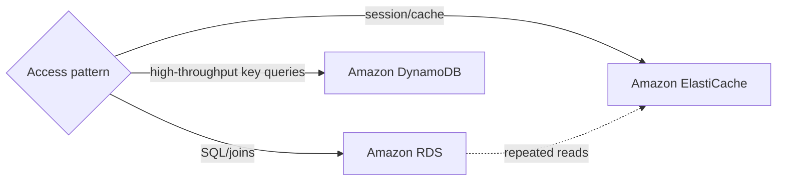

import KeywordTable from '../../../../components/content/KeywordTable.astro';
import Attribution from '../../../../components/content/Attribution.astro';
import MarkComplete from '../../../../components/progress/MarkComplete.astro';

> **Source:** Implementing Microservices on AWS, প্রিন্ট পেজ ৭ (Simplifying operations ও data store নির্বাচন)।

Microservice-এ ব্যবসায়িক ক্ষমতা ভাগ করার সাথে data ownership-ও ভাগ করার প্রয়োজন হয়। Service-specific data store হলে deployment, scaling ও failure isolation ভালো থাকে। সিদ্ধান্ত করার সময় data shape, query pattern, consistency ও scale দেখুন।

## Data store নির্বাচন

- **Session data**: in-memory cache সাধারণ best fit।
- **Redis**: rich data structures, advanced cache patterns ও replication।
- **Memcached**: simple distributed memory cache।
- **Amazon RDS**: managed relational database; SQL and relational model প্রয়োজনে।
- **Amazon DynamoDB**: managed NoSQL; লক্ষ লক্ষ request, almost unlimited throughput ও schema flexibility-তে শক্তিশালী।

## DynamoDB মূল বৈশিষ্ট্য

- **Partition key**: item বিতরণ ও scalability নির্ধারণ করে।
- **Sort key**: এক partition-এর ভেতর item সাজায়; composite primary key তৈরি করে।
- **Low latency**: predictable single-digit millisecond response সম্ভব।

> **Exam trap:** “high traffic” শুধু DynamoDB বোঝায় না। Access pattern, consistency, join, query flexibility ও cost একসাথে মিলিয়ে decision নিন।

<Attribution sourceUrl={frontmatter.sourceUrl} updated={frontmatter.updated} />
<MarkComplete lessonId="microservices-5" />
