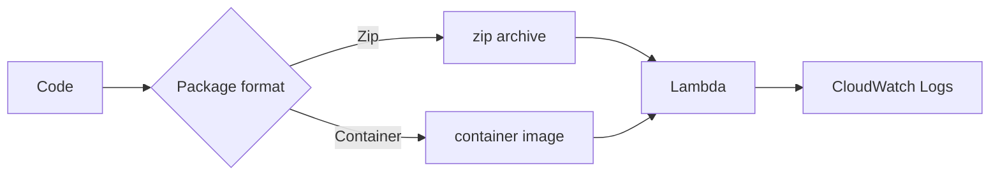

import KeywordTable from '../../../../components/content/KeywordTable.astro';
import Attribution from '../../../../components/content/Attribution.astro';
import MarkComplete from '../../../../components/progress/MarkComplete.astro';

এই লেসনে আমরা Lambda code deploy করার পদ্ধতি জানব। Zip সাধারণ dependency এর জন্য ভাল, container image বড় dependency বা Docker-native workflow এর জন্য ভাল।

## Deployment tools

- **AWS SAM** serverless app তৈরি ও deploy করার দ্রুত পদ্ধতি।
- **AWS CDK** programming language দিয়ে infrastructure define করে; জটিল project এ reusable construct ভালো হয়।
- **Lambda Layers** common dependencies আলাদা করে কমপ্লেক্সিটি কমায়।
- **SnapStart** Java function cold start কমায়।
- **Powertools** observability, idempotency, structured logging ও safe fault handling দেয়।

> [!NOTE]
SAM এবং CDK একই জিনিস নয়। SAM Lambda-focused serverless development workflow; CDK programming language-ভিত্তিক general infrastructure.

<KeywordTable keywords={frontmatter.keywords} />

<Attribution sourceUrl={frontmatter.sourceUrl} updated={frontmatter.updated} />
<MarkComplete lessonId="microservices-6" />
