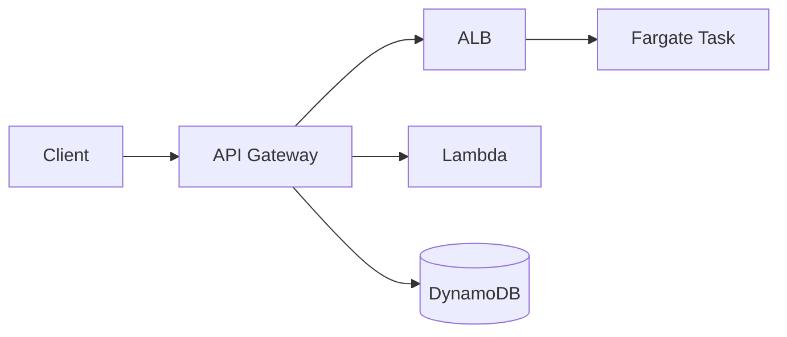

import KeywordTable from '../../../../components/content/KeywordTable.astro';
import Attribution from '../../../../components/content/Attribution.astro';
import MarkComplete from '../../../../components/progress/MarkComplete.astro';

এই লেসনে জানা যায় কীভাবে অনেক tenant-কে একসাথে serve করা যায় এবং API-কে route, protect ও monitor করা যায়।

> **Source:** Implementing Microservices on AWS, প্রিন্ট পেজ ৯–১০ (Multi-tenancy ও API management)।

## Isolation models

- **Silo:** প্রতি tenant আলাদা resource stack। ব্যয়বহুল কিন্তু নিরাপদ।
- **Pool:** একসাথে বহু tenant একই resource stack ব্যবহার করে। cost কম কিন্তু isolation কম।
- **Bridge:** কিছু data শেয়ার হয়, কিন্তু critical operations আলাদা।
- Tenant isolation প্রায়ই matching app layer, data layer, IAM এবং network isolation এর সময় ভাবতে হয়।

## API management

- API Gateway প্রায়ই version routing handle করে — যেমন `/products/v1` ও `/v2` আলাদা রাউট।
- REST API-র সব সুবিধা দরকার হলে API Gateway REST API; হালকা ও সস্তা বিকল্প হলো HTTP API।
- ALB path-based routing-এ ভালো; NLB উচ্চ throughput ও static IP-তে কাজ করে।
- API Gateway এক জায়গায় versioning, request validation, rate limiting, caching, monitoring ও traffic management দেয়।
- request validation, authorization ও response mapping-এর জন্য API Gateway প্রচলিত পছন্দ।

> [!NOTE]
API Gateway বেশি সুবিধা দেয় কিন্তু শুধু ALB দিয়ে routing করা যায়। প্রশ্ন বললে একাধিক functionality দরকার হয় তখন API Gateway বেছে নিন।

<KeywordTable keywords={frontmatter.keywords} />

<Attribution sourceUrl={frontmatter.sourceUrl} updated={frontmatter.updated} />
<MarkComplete lessonId="microservices-7" />
