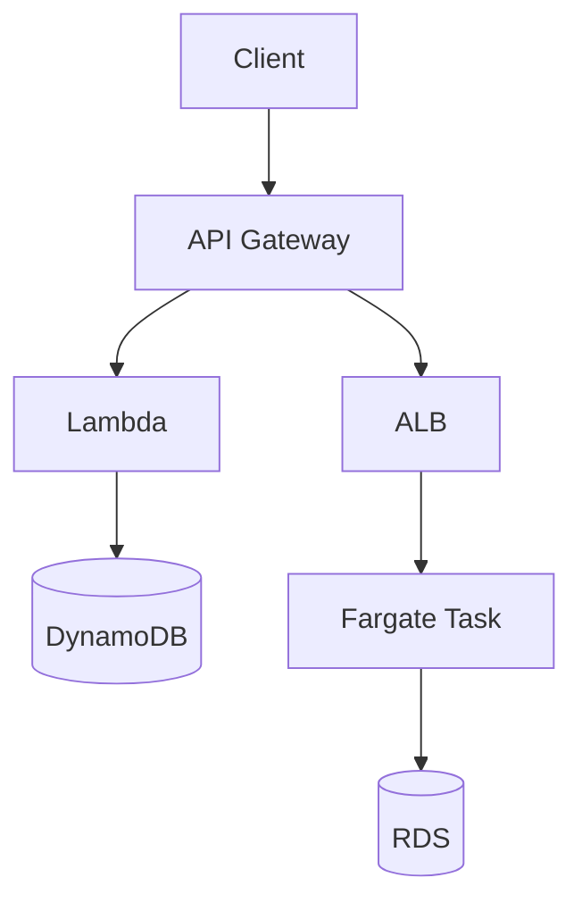

import KeywordTable from '../../../../components/content/KeywordTable.astro';
import Attribution from '../../../../components/content/Attribution.astro';
import MarkComplete from '../../../../components/progress/MarkComplete.astro';

এই লেসনের উদ্দেশ্য দুটি বাস্তব প্যাটার্ন চেনা: সম্পূর্ণ Lambda-based API এবং Fargate-based container API। দুটিই operational overhead কমায়, কিন্তু নকশা ভিন্ন।

## Pattern ১: API Gateway + Lambda

এখানে frontend API traffic API Gateway পরিচালনা করে, request → Lambda function → DynamoDB। Lambda প্রতি রিকোয়েস্ট অনুযায়ী scale হয়; DynamoDB item persist করে। ফলে server fleet, patching ও idle capacity ম্যানেজ করা লাগে না।

## Pattern ২: API Gateway/ALB + Fargate

এখানে container image চালাতে হলে Fargate use করুন। API Gateway → ALB → Fargate task প্যাটার্ন বা সরাসরি ALB/NLB → Fargate কাজ করতে পারে। এতে Docker image, environment dependencies, health checks ও library/runtime control সমর্থন পাওয়া যায়।

## Asynchronous worker

S3 event → SQS বা EventBridge → Lambda/Fargate অনেক সময় ব্যবহার হয়। SQS buffering দেয়; Lambda auto-scale করে। Duplicate message অসম্ভব না হলে handler idempotent করতে হবে।

> [!NOTE]
"Serverless" মানে Lambda নয়। Fargate-ও serverless; এটি শুধু container workload চালায়। প্রশ্নে Docker image, long-running process বা library/runtime control থাকলে Fargate ভাবুন।

<KeywordTable keywords={frontmatter.keywords} />

<Attribution sourceUrl={frontmatter.sourceUrl} updated={frontmatter.updated} />
<MarkComplete lessonId="microservices-8" />
