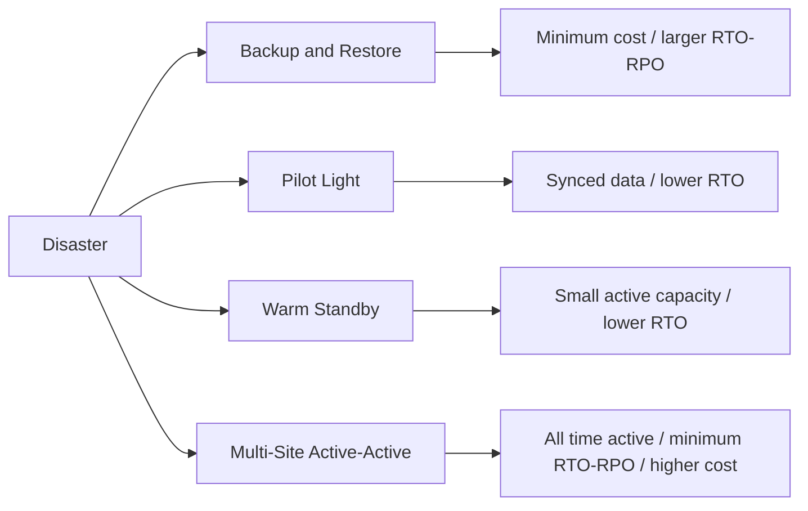

import ExamTrap from '../../../../components/content/ExamTrap.astro';
import KeywordTable from '../../../../components/content/KeywordTable.astro';
import Attribution from '../../../../components/content/Attribution.astro';
import MarkComplete from '../../../../components/progress/MarkComplete.astro';

> **Source:** Implementing Microservices on AWS, প্রিন্ট পেজ ১৩–১৪ (Resilient and efficient systems, Disaster recovery ও High availability)।

## Resilient system মানে কী?

**High Availability** মানে system নির্দিষ্ট availability target বজায় রাখে এবং component failure সামলায়। **Disaster Recovery** হলো region-level/major disruption থেকে business service ফিরিয়ে আনার পরিকল্পনা। Microservices সাহায্য করে কারণ stateless services ও ছোট deployment unit সহজে replace করা যায়।

## RTO বনাম RPO

- **RTO (Recovery Time Objective)**: maximum accepted time until service is available again।
- **RPO (Recovery Point Objective)**: maximum accepted amount of data loss, usually time-based।

## Statelessness ও Twelve-Factor App

Stateless principle hot-swappable ও autoscaling system তৈরি সহজ করে। Microservice process নিজস্ব session/state/properties ভাগ না করে persistent data source-এও সংরক্ষণ করে। **Twelve-Factor App** process-ভিত্তিক architecture, backing services-এ config/state বাইরে রাখার সুযোগ দেয়।
আর: load balancer/reverse proxy, DNS/Route 53, content delivery, request throttling, API Gateway, Amazon Cognito, AWS App Mesh, service discovery engines ইত্যাদি।

## Multi-AZ বনাম Multi-Region

`Multi-AZ` deployment এক region-এর ভেতরের বিভ্রাটে availability বাড়ায়। যেমন instance/AZ issue ধরা পড়লে অন্য AZ-এ stateless task reconnect করে।

**Multi-Region DR** একটি region চালু না থাকলে অন্য region-এ recover করে। DR প্রায়শই মূল region চালু থাকলে normal operations ফিরিয়ে আনার plan/strategy-র সাথে মিলে যায়। প্রধান architecture patterns:

- **Backup and Restore**: backup/restorable copy তৈরি রাখা।
- **Pilot Light**: data replication and minimal core in alternate region।
- **Warm Standby**: scaled-down active environment ready in alternate region।
- **Multi-Site Active-Active**: multiple regions serving production traffic simultaneously।

<ExamTrap title="Multi-AZ বনাম DR" question="Multi-AZ design কি Disaster Recovery architecture?" answer="না। Multi-AZ সাধারণত regional fault isolation/simultaneous AZ failure সামলায়।" />

Exam প্রশ্ন মিলাতে context দেখুন: regional event/disaster scenario — Multi-Region; regional fault isolation/simultaneous AZ failure — Multi-AZ; specific RTO/RPO targets — exact amount heavy resilience architectures।

<Attribution sourceUrl={frontmatter.sourceUrl} updated={frontmatter.updated} />
<MarkComplete lessonId="microservices-9" />
